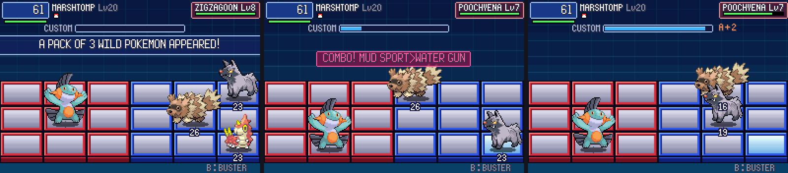
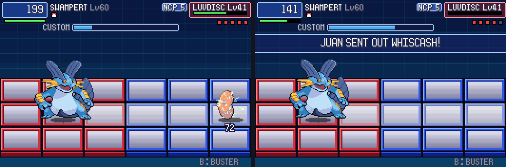

# POC-11 — Play log, code picker and chip shelves, overworld tests, partner chips, wild packs, rival trainers

**Patches:** on top of 0001–0016.
- `poc/patches/0017-POC-11a-play-session-log-pkbn_playlog.jsonl-one-JSON.patch`
- `poc/patches/0018-POC-11b-code-picker-for-Ultra-Master-Ball-chips-Poke.patch`
- `poc/patches/0019-POC-11c-overworld-self-tests-scripted-keys-in-a-real.patch`
- `poc/patches/0020-POC-11d-partner-chips-story-slots-friendship-levels-.patch`
- `poc/patches/0021-POC-11e-wild-packs-2-3-wild-Pokemon-on-the-grid-BN-v.patch`
- `poc/patches/0022-POC-11f-trainers-as-Navi-rivals-NaviCust-programs-an.patch`

`scripts/setup_host.sh` applies them all. Applying 0001–0022 onto pin `116582559947f4c9fbd5cdfd601f258b553661d5` was
checked in a clean worktree.

**New tools and scripts:**

| file | what it does |
|---|---|
| `tools/playlog_report.py` | Summarises `pkbn_playlog.jsonl`: Busting Levels by clock, score parts, rewards, chips used. |
| `scripts/owtests.sh` | Seven overworld self-tests (below). Run it from the host build folder. |

Values marked TUNE are our own numbers, not taken from either game.

## 11a — play-session log

- Every battle appends one JSON line to `pkbn_playlog.jsonl`, next to the save.
- A line holds the outcome, the enemy party, the chips and Program Advances used, both Busting clocks with their score
  parts, the Capture Grade and the reward.
- Self-tests only write it when `PKBN_PLAYLOG=path` is set, so test runs don't pollute a real log.
- `tools/playlog_report.py` turns a session's log into the numbers we tune with.

## 11b — code picker and chip shelves

- **Ultra Ball and Master Ball catches let you pick the code.** The post-battle screen shows the move's codes;
  LEFT/RIGHT picks one and A confirms. Other balls choose the code on their own: the themed lane if the move has it,
  otherwise random.
- **No MB budget.** The folder has no total-MB limit (user decision). The only limits are the copy caps by MB.
- **Poké Mart chip shelves.** Marts have a CHIPS action next to BUY and SELL.
  - Each MAPSEC has its own curated stock of 8 chips.
  - Price is 60 × MB.

## 11c — overworld self-tests

`PKBN_OWTEST="group:num:x:y"` starts a new game in that map with a party (`PKBN_OWTEST_PARTY`), flags, items and
money. `PKBN_OWKEYS` is then played as key presses. `src/pkbn/owtest.c` documents the token syntax.

| test | checks |
|---|---|
| `start_folder` | START → FOLDER (9 menu entries), pages, back to the field |
| `party_navicust` | party menu → NAVICUST |
| `mart_chips` | Oldale Mart → CHIPS, buy a chip |
| `wild_battle` | a wild battle from the field, the autopilot fights it, back to the field, play log written |
| `wild_pack` | a 3-Pokémon pack drawn from Route 101's own grass table, each one fainting in turn |
| `tm_script` | `additem` of a TM from a script grants 2 chips |
| `relearner` | the Move Relearner grants a chip in a new code |

All seven pass.

## 11d — partner chips

- **Four story slots.** They unlock after the Route 103 rival battle (`FLAG_DEFEATED_RIVAL_ROUTE103`) and badges
  3, 5 and 7.
- Each slot holds a party Pokémon and one of its moves. You set them on the FOLDER screen's PARTNER page: A cycles
  the Pokémon, SELECT cycles the move.
- **In battle** a partner chip (code `*`) brings that Pokémon in to use the move, like a Navi chip.
  - If the partner is already in, it just uses the move.
  - Only partner chips show the Pokémon's sprite.
- **Levels from friendship:** V1 below 150, V2 at 150 or more (×1.3 power), V3 at 220 or more (×1.6). TUNE.
- **`pkbn.sav` version 3** adds the slots. Older versions migrate.

## 11e — wild packs (2–3 wild Pokémon, BN virus style)

- **Where packs come from:** only the two standard encounter calls in `StandardWildEncounter`, grass and water
  (`src/wild_encounter.c`).
  - The extras use the same encounter table and the same slot and level rolls as the first Pokémon
    (`ChooseWildMonIndex_Land` / `_WaterRock`, `ChooseWildMonLevel`).
  - Scripted, static, roamer, fishing and Safari battles never bring a pack. Neither do trainers.
- **Odds** (TUNE), with `b` = badges:
  - With 0 badges, 10% of battles are a pack of 2.
  - Otherwise, 3b% of battles are a pack of 3, and another (25 + 4b − 3b)% are a pack of 2.
- **Start positions:** (4,1), (5,0) and (5,2). The foes' attack timers are staggered.
- **Intro text:** "WILD X AND Y APPEARED!" (Emerald's `sText_TwoWildPkmnAppeared`). A pack of 3 gets
  "A PACK OF 3 WILD POKEMON APPEARED!".
- **Rules with more than one foe:**
  - **Targeting:** the player's buster and moves aim at the nearest foe in the player's row, or else the closest one.
    The top-right box follows that target, and every foe shows its HP under its feet.
  - **Area attacks** (swords, bombs, field moves, meteors and so on) hit every foe standing in the area.
  - **Projectiles** hit whoever they meet. Cannons stop at the first foe.
  - **Panels:** foes never share a panel.
  - **Fainting:**
    - Each foe gives its EXP when it faints.
    - Its pending attacks vanish (BN deletion).
    - The battle is won when the last foe falls.
  - **Catching:** a ball can only be thrown when one foe is left ("CAN'T AIM WITH MORE THAN ONE OUT!").
  - **Multi-delete:** BN6's rule is real now. Deletes within a 10-frame window chain together and score (m−1)×2, with
    BN6's call-outs: DOUBLE, TRIPLE and QUADRUPLE DELETE (asm/asm00_1.s:16931-16972, research/06 §2.4).
    - The Busting Level takes the better of this and the chip-chain ADAPT.
    - Rewards pick a random foe of the pack, as BN6 does.
- **How it works:** `sB.f[SIDE_ENEMY]` is always the selected foe; `Foe_Select` swaps the others in and out. A battle
  with one foe runs exactly as before: every single-foe regression log is byte-identical to the run before this change.
- **Self-tests:**
  - `PKBN_TEST_FOES="species:level,…"` adds foes to a self-test battle.
  - The owtest token `J` allows a pack for the next `G` battle. `PKBN_TEST_PACK_EXTRA=n` forces the pack size.

## 11f — trainers as Navi rivals

- **Who counts as a rival** (`src/pkbn/rival.c`, tiers TUNE):

  | trainer | tier |
  |---|---|
  | Gym Leaders, first battles | 1, 1, 2, 2, 3, 3, 4, 4, in badge order |
  | Gym Leader rematches, Elite Four, Champion | 5 |
  | Archie and Maxie | 4 |
  | May/Brendan, by their lead's level | ≤15: 1, ≤25: 2, ≤35: 3, else 4 |

- **NaviCust programs.** Each of their Pokémon gets an automatic layout. It uses the player's board and compiler, and
  any part that would cause a bug is left out. Programs by tier (TUNE):

  | tier | adds |
  |---|---|
  | 1 | HP+50, the type booster for its first type |
  | 2 | HP+100 instead of HP+50; Protein or Calcium (whichever attack stat is higher) |
  | 3 | FstBarr, Carbos |
  | 4 | HP+200 instead of HP+100; UnderSht, Leftovrs |
  | 5 | ScopLens, SuprArmr, the booster for its second type |

  - The board is 5×4, so a tier-5 Pokémon ends up with about 5 programs. Juan's Pokémon each ran 5.
  - The HUD shows "NCP n" next to the name.
- **Smarter move choice.** Rivals score their moves with their own Emerald AI flags (`gTrainers[].aiFlags`). Emerald's
  scoring is followed: every move starts at 100, the highest score wins, and ties are broken at random
  (`battle_ai_script_commands.c:326`, `:423-445`). Only the parts that read state the grid has are modelled.
  - **AI_CheckBadMove** (`data/battle_ai_scripts.s:51`):
    - −10 if the move has no effect on the target.
    - −12 if the target's ability absorbs it.
    - −10 for a status move on a target that already has a status or Safeguard.
    - −10 for Confuse on a confused target, Attract on an infatuated or Oblivious one, or Attack Up already at +6.
  - **AI_TryToFaint** (`:2616`):
    - +4 if the move can knock the target out, +6 for Quick Attack.
    - −1 if it can't and isn't the strongest move.
    - +2 on a ×4 hit, 176 times in 256.
  - **AI_CheckViability** (`:652`) is long, so it is reduced to a few TUNE weights:
    - +1 for super effective, −1 for not very effective.
    - +1 for a status move while the target is above half HP.
    - Recovery moves: +2 below half HP, −5 above 90%.
  - The damage these rules need comes from `Moves_EstimateDamage`: Emerald's `CalculateBaseDamage` plus STAB and the
    type chart, with no random roll, no crit and no side effects.
- **Pace:** rivals attack 5% sooner per tier (TUNE).
- **Unchanged:** ordinary trainers and wild Pokémon keep the random picker. Across the regression suites, only the two
  Roxanne tests (x3, x10) changed their logs, and their outcomes stayed the same.
- `PKBN_NO_RIVALS=1` turns all of this off, for comparisons.

## Verification

- Regression suites (`runall`, `runk`, `rune`, `runpa`, `run7`, `run7b`, `run7c`):
  - Logs are identical to the POC-11d run except x3 and x10 (Roxanne, now a rival).
  - e2 still times out, as noted in POC-10.
- NaviCust tests: pass.
- Overworld tests: 7/7 pass.
- Pack self-tests:
  - Marshtomp vs Zigzagoon + Poochyena + Wurmple: won at Busting Level S.
  - Marshtomp vs a pack of 2 with a Master Ball: one foe went down first, then the ball was thrown at the one left and
    caught it. The post-battle screen named the right Pokémon.
- Rival self-tests: Roxanne (tier 1), the Route 103 rival (tier 1), Juan (tier 4) and Wallace (tier 5) all logged
  their programs and AI flags.

## Open / TUNE

- Pack odds, start positions and the attack stagger.
- The targeting rule. BN aims a buster down the row; we also use it to pick the target of status moves.
- Rival tiers and program lists. Whether ordinary trainers with `AI_SCRIPT_CHECK_BAD_MOVE` should also use the scorer.
- Not verified at runtime yet: release candy, egg moves from hatching, Pokédex milestones, shiny copies.
