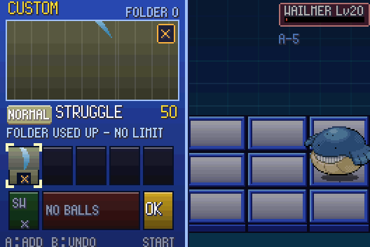

# POC-12 — Struggle fallback, untested chip sources checked, a smarter test bot

**Patches:** on top of 0001–0022.
- `poc/patches/0023-POC-12a-Struggle-chip-when-the-folder-is-used-up-tes.patch`
- `poc/patches/0024-POC-12b-test-bot-PKBN_BOT-smart-dodges-lines-up-chip.patch`

**New tools:** `tools/bot_compare.py` runs the same battles with the old autopilot and the new bot. The test list in
`scripts/owtests.sh` grows to 13 checks.

## 12a — Struggle when the folder is used up

- **The gap:** a folder of 15 or more chips doesn't reshuffle, because copies are the stamina. Once the pile was empty,
  a hand of chips the Pokémon in battle can't use left only the buster.
- **The rule:** when the draw pile is empty and nothing left in the hand works for whoever is in, the hand gets
  **Struggle**.
  - This is Gen 3's own answer to running out of PP: `noValidMoves` → `MOVE_STRUGGLE` with no PP spent
    (`battle_util.c:99-105`).
  - It is a `*` chip that is never used up, labelled "FOLDER USED UP – NO LIMIT". Any Pokémon can use it.
  - Its grid shape and recoil were already there (sword, 1/4 recoil).
- A Struggle chip only appears while nothing usable is in the hand. Status chips still count as usable, as in Gen 3,
  where Struggle only comes when no PP is left.
- About e2 (the old timeout): it wasn't this stall. Its folder is 9 chips, so it reshuffles, and the battle is just
  long (Jigglypuff's Rest) for a bot that stands still. The new bot wins it in 17 s.

## 12a — the four chip sources nobody had seen work

| check | how | result |
|---|---|---|
| Release → candy | owtest: Oldale Pokémon Center PC → Withdraw → a Lv35 Zigzagoon in box 1 → Release → Yes | "Bye-bye, ZIGZAGOON!", 2 Normal candy (Lv30+ gives 2) |
| Hatching → egg-move chips | owtest: a Mudkip egg knowing Stomp and Curse, one step in Oldale | hatches; +1 Stomp, +1 Curse |
| Pokédex milestones | self-test: 9 species already caught, catch a 10th; 49 → 50th | PP Up at 10, PP Max at 50 |
| Shiny catch | self-test: a shiny Zigzagoon (personality built against the player ID) | "IT'S SHINY! GOT 2 * CHIPS OF ITS MOVES!" |

Note: Mirror Coat and Uproar aren't chips (both were cut in the lane review), so a hatchling that knows them gets nothing
for them. That is by design.

**New test switches:**
- Owtests:
  - A player name is set, so name texts print.
  - `PKBN_OWTEST_BOX` puts Pokémon in box 1.
  - A party entry `e<species>:lv:moves` is an egg that hatches on the next step.
  - The token `Y` waits for the message box to finish printing.
- Self-tests: `PKBN_TEST_SHINY=1` and `PKBN_TEST_DEX_CAUGHT=n`.

All 13 checks in `scripts/owtests.sh` pass.

## 12b — the test bot (`PKBN_BOT=smart`)

The old autopilot stands still, picks chips in hand order, and opens the Custom screen with chips still queued (they're
lost). That made test numbers look nothing like play. The bot (`src/pkbn/bot.c`, all TUNE, a test tool rather than a
rule) does this:

- **Custom:** picks up to 3 chips by value against the target. Damage moves are valued by expected damage
  (`Moves_EstimateDamage`) as a share of the target's HP. Status, stat and healing moves get small fixed values;
  healing only counts below half HP.
- **Fight:**
  - It steps off any panel an enemy attack is about to hit.
  - It walks to the nearest safe panel from which the next chip reaches the target, then fires. The check uses the
    real attack shapes (`Moves_WouldHit` → `DirectCells` / `BlastCells`). After 150 frames it fires anyway.
  - With nothing queued, it lines up and uses the buster.
- **Custom gauge:** it opens the Custom screen only once its queue is empty.

The old autopilot is still the default, so the regression baselines hold. All suites gave logs identical to POC-11.

### Same 17 battles, old autopilot vs bot (`tools/bot_compare.py`)

| battle | old | bot |
|---|---|---|
| x4 Torchic vs Wurmple | won, L10, 16 s | won, L9, 9 s |
| x5 Marshtomp vs Wailord | won, L10, 36 s | won, L9, 41 s |
| x7 Mudkip 8 vs Geodude 20 | **lost** | **won**, L8 |
| t2 / t4 / t6 / t7 | won, L9 / 10 / 9 / 9 | won, L10 / S / 7 / 10 |
| e1 Mudkip vs Graveler | **lost** | **won**, L10, 6 s |
| e2 Mudkip vs Jigglypuff | **timeout** | **won**, L10, 17 s |
| e3 vs Xatu | Xatu teleported away | same |
| e4 vs Pidgeotto | won, L8 | won, S |
| e5 vs Grimer | lost | lost |
| p3, trio vs Poochyena | won, L6 | won, L6 |
| k3 / k6 vs Wailord 45 | won, S / L10 | won, L9 / L8 |
| r1 Roxanne | won, S | won, S |
| w1 pack of 3 | won, L10, 32 s | won, L9, 8 s |
| **total** | **12/17 won**, avg L9.4, 20 s of fight | **15/17 won**, avg L9.2, 16 s of fight |

**What this says for tuning (no numbers changed yet):**
- Even a moving, dodging bot gets L9–S almost every time. The time and step points aren't what's inflating the
  score. The hit counter is: it only counts hits that stun or push (BN6 counter 3), and few Pokémon attacks do either,
  so "no hits" (+1) is nearly free.
- Proposed fix for a later round: count every damaging hit taken, and/or score damage taken as a share of max HP.
- Moving costs the steps point (+1 for 2 steps or fewer). That is BN6's rule, and the bot feels it in k3/k6.

## Open

- Hit counting in the Busting Level (above). It's a design decision, so it waits for you.
- The bot's own weights (TUNE). It never switches Pokémon and never plans chains or Program Advances.
