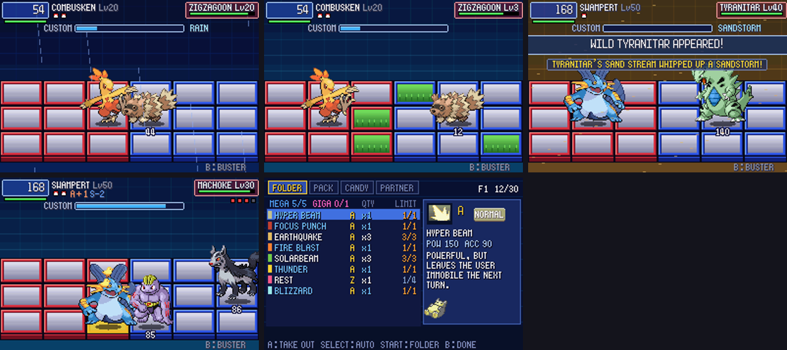

# POC-13 — Weather and terrain, abilities, Mega/Giga chips, three folders, wild patterns, double battles

**Patches:** on top of 0001–0025.
- `poc/patches/0026-POC-13a-overworld-weather-and-terrain-follow-you-int.patch`
- `poc/patches/0027-POC-13b-abilities-on-the-grid-weather-on-entry-Intim.patch`
- `poc/patches/0028-POC-13c-MegaChips-and-GigaChips-BN6-limits-5-Mega-1-.patch`
- `poc/patches/0029-POC-13d-three-folders-BN6-Folder-1-Folder-2-extra-ST.patch`
- `poc/patches/0030-POC-13e-wild-Pokemon-fight-in-virus-style-patterns-f.patch`
- `poc/patches/0031-POC-13f-a-kept-hand-the-active-Pokemon-can-t-use-goe.patch`
- `poc/patches/0032-POC-13g-battle-messages-fit-and-sit-under-the-intro-.patch`

Applying 0001–0032 onto the pin was checked in a clean worktree.

*Top row: rain on Route 120 is rain in battle; tall grass gives grass panels; Tyranitar's Sand Stream on entry.
Bottom row: two trainers at once (Machoke and Mightyena on the grid together); the FOLDER screen with the
Mega/Giga counts.*

Values marked TUNE are our own numbers, not taken from either game.

## 13a — the overworld follows you into battle (item 7)

- **Weather:** Emerald starts a battle with the map's weather (`ABILITYEFFECT_SWITCH_IN_WEATHER`,
  `battle_util.c:2490-2530`), and so does the grid:
  - Rain, thunderstorm and downpour give rain.
  - Sandstorm gives sandstorm, and drought gives sun.
  - The weather is permanent, as in Gen 3. The HUD shows "RAIN" with no turn count, and a weather move can still
    replace it.
  - It uses Emerald's own texts: "IT IS RAINING.", "A SANDSTORM IS RAGING." and "THE SUNLIGHT IS STRONG."
- **Terrain** (our design, TUNE): panels that never fade, never placed where a fighter starts.
  - A battle in tall grass starts with 2 grass panels on each side.
  - A cave or mountain battle starts with 1 cracked panel on each side.
- Real maps only; self-tests start as before.
- New owtest token: `Vn` sets the field weather.

## 13b — abilities on the grid (item 3)

Gen 3 rules where the grid has the same situation, with cites. ADAPT where the grid needs its own meaning.

| ability | on the grid | source |
|---|---|---|
| Drizzle / Drought / Sand Stream | permanent weather when it comes in | `battle_util.c:2532-2558` |
| Intimidate | −1 Attack to the foe when it comes in (every foe of a pack); Clear Body, White Smoke and Hyper Cutter block it | `:2559` |
| Static / Flame Body / Poison Point | a contact move on it: 1 in 3 the attacker is paralysed / burned / poisoned | `:2806-2850` |
| Effect Spore | contact: 1 in 10, sleep, poison or paralysis | `:2782` |
| Rough Skin | contact: the attacker loses 1/16 of its max HP | `:2767` |
| Cute Charm | contact: 1 in 3, infatuation (opposite genders) | `:2851` |
| Swift Swim / Chlorophyll | Speed ×2 in rain / sun: faster steps and attacks | `battle_main.c:4606` |
| Speed Boost, Rain Dish, Shed Skin | +1 Speed / 1/16 HP in rain / 1 in 3 status cure, at the end of each turn | `battle_util.c:2600-2652` |
| Early Bird | sleep counts down twice as fast | `:2030` |
| Truant | ADAPT: it loafs around every other turn ("IS LOAFING AROUND!") | `:2653` |
| Natural Cure | status cured when it switches out | `battle_script_commands.c:9616` |
| Run Away | always escapes, even from Mean Look | `battle_util.c:427` |
| Shadow Tag / Arena Trap / Magnet Pull | the player can't run (Arena Trap: unless Flying or Levitate; Magnet Pull: Steel types) | `battle_main.c:4036-4070` |
| Levitate | ADAPT: floats like the FlotShoe/AirShoes programs (stands on holes, no poison panels, no ice slides) | — |

Abilities that already worked through Emerald's own damage code (Huge Power, Thick Fat, Guts, Wonder Guard, the
absorbing abilities and so on) are unchanged.

Battle messages are now longer and appear under the intro banner, so a switch-in ability is readable at the start.

## 13c — MegaChips and GigaChips (item 2)

- **The BN6 rules, from its code:**
  - MegaMan starts with room for **5 MegaChips and 1 GigaChip**. These are bytes +6 and +7 of his entry in
    `byte_80210DD` (`data/dat01.s:295`), read by `init_8013B64` (`asm/asm00_2.s:10942-10945`).
  - The MegFldr1/2 and GigFldr1 programs raise these limits (`asm/asm37_0.s:2214-2262`). We have no such programs yet.
  - The folder allows "only 1 of the same MegaChip / GigaChip" (`CompText86CF1A8` unk4/5).
- **Our classes (TUNE):**
  - **Giga:** the legendaries' signature moves: Sacred Fire, Aeroblast, Mist Ball, Luster Purge, Doom Desire and
    Psycho Boost.
  - **Mega:** damaging moves of 36 MB or more (power 120+: Hyper Beam, the starters' ultimate moves, Eruption,
    Thunder, Fire Blast, Blizzard, Hydro Pump, Explosion and so on), plus the one-hit KO moves.
- **Where the limits apply:** both folder builders and the FOLDER screen, which uses BN6's messages ("YOU CAN USE ONLY
  5 MEGACHIPS", "ONLY 1 OF THE SAME MEGACHIP").
- **On screen:**
  - On the Custom screen, Mega chips have a blue frame and Giga chips a pink one, with a MEGA or GIGA tag by the name.
  - The FOLDER page shows "MEGA n/5 GIGA n/1", and those rows are coloured.

## 13d — three folders (item 10)

- Folder 1, Folder 2 and Folder 3, like BN6's Folder 1, Folder 2 and extra folder.
- On the FOLDER page, **START** moves to the next folder, and the folder you leave on is the one equipped. The header
  shows `F2 12/30` (or `AUTO` for a folder you haven't edited).
- **`pkbn.sav` version 4** adds folders 2 and 3 and which folder is equipped. Version 3 files migrate: folder 1 is
  kept and equipped, folders 2 and 3 start empty. A real v3 file was tested.

## 13e — wild Pokémon patterns (item 1)

Each wild Pokémon gets a BN-virus-style pattern from its own base stats (TUNE). The log says "X fights as a SNIPER".

| style | who | how it fights | share of all 386 species |
|---|---|---|---|
| HARASSER | Speed 90+, or Speed is its best stat | front column on your row; steps ×0.55, attacks ×0.8, dodges ×1.3; prefers priority moves, dashes and swords | 120 |
| BRUISER | Attack ≥ Sp. Atk + 10 | walks to the front on your row; prefers swords and dashes | 91 |
| SNIPER | Sp. Atk ≥ Attack + 10 | middle column on your row; prefers cannons, waves and balls | 64 |
| TURRET | Speed ≤ 45 with HP, Def or Sp. Def 80+ | back column, steps ×2.5, attacks ×1.1, dodges ×0.5; prefers bombs and attacks that land wherever you stand | 53 |
| BALANCED | the rest | wanders, one panel at a time | 58 |

- They move one panel at a time, with a random step 1 time in 4 so they aren't fully predictable.
- They pick a move that suits their style 2 times in 3.
- Trainers keep their own AI (the rival scorer, or random for ordinary trainers).
- `PKBN_NO_STYLES=1` turns patterns off.

## 13e — double battles (item 5)

- **Routed to the grid:**
  - A trainer marked as a double-battle trainer, such as Tate & Liza.
  - Two trainers who spot you at once (`DOUBLE | TWO_OPPONENTS | TRAINER`). Each trainer's party is built into its own
    half of the enemy party, as Emerald does (`battle_main.c:697-699`).
  - Multi battles with an in-game partner stay vanilla.
- **On the grid:**
  - Both foes are out together, using the wild-pack system.
  - When one faints, that foe's trainer sends their next Pokémon into the same spot ("FREDRICK SENT OUT MACHOKE!").
  - The battle is won when nobody has anyone left.
- **Text:** "FREDRICK AND MATT WANT TO BATTLE!" (`sText_TwoTrainersWantToBattle`, without the classes so it fits).
- **Prize money:** as Emerald: ×2 against one double-battle trainer, and each of two trainers pays their own
  (`battle_script_commands.c:5644-5656`).
- Rival programs and AI follow trainer A, so Tate & Liza fight as a tier-4 rival.

## 13f — a fix the new patterns exposed

- **The bug:** a kept hand that the Pokémon in battle can't use at all (all teammates' chips) used to stay forever, so
  only the buster was left. BN keeps unselected chips, and the old autopilot never switches Pokémon.
- **The fix:** such a hand now goes back under the pile (not discarded, because copies are stamina) and a fresh hand
  is drawn. The log says "hand of 5 chips COMBUSKEN can't use: back under the pile".

## Verification

- **Regression suites:** every outcome is the same as POC-12 except e2. It used to time out; the bot now loses it.
  Fight logs differ by design: patterns, abilities and the hand rule.
- **NaviCust tests:** all pass. n3 had started timing out (the stuck hand); it is fixed by 13f.
- **`scripts/owtests.sh`:** 16/16 pass. New checks: map rain in battle, Sand Stream, two trainers.
- **Hand checks:**
  - Mega limits: Snorlax with 9 Mega-class moves in the pack got exactly 5 in the auto-built folder, 1 copy each.
  - Folder switching: F1 edited, F2 edited, F3 auto, back to F1; the battle used the equipped one.
- **Abilities seen in logs:** Intimidate (Mightyena), Sand Stream (Tyranitar), Speed Boost (Ninjask), Truant
  (Slakoth skips every other turn), Static (paralysed Machop).
- **`tools/bot_compare.py`:** the bot wins 14 of 17 battles and the old autopilot 12. Pidgeotto (a HARASSER) now beats
  the bot. Bot Busting Levels averaged L9.6, back up from L8.9, because foes that come to your row are easier to hit.

## Open / TUNE

- The style thresholds and multipliers. Caterpie and Weedle come out as HARASSERs (low stats, Speed 45 is their best).
- The Mega threshold (36 MB) and the Giga list. Whether NaviCust MegFldr/GigFldr programs should come next.
- The custom gauge at Speed −6 fills 4× slower (an older rule). A Scary Face spammer such as Mightyena makes for very
  long fights.
