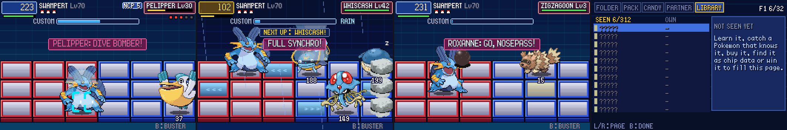
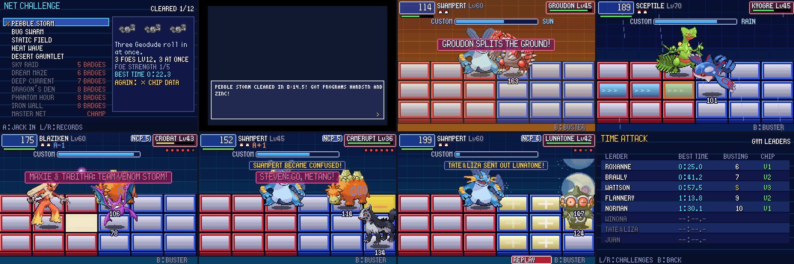

# POC-14 — Rival combos and team PAs, Full Synchro, road panels, Leader chips, Library, earned NaviCust programs, NET CHALLENGE, legendary bosses, replays, time attack

**Patches:** these go on top of 0001–0032.

- `poc/patches/0033` … `0044` (POC-14a … POC-14l)
- Applying 0001–0044 onto the pin was checked in a clean worktree. The resulting sources match the host build; only generated files differ.

*14a–f, left to right:*

1. Winona's Pelipper fires its Program Advance, DIVE BOMBER.
2. A counter hit sets off Full Synchro, with currents on the water.
3. A Leader chip calls in Roxanne's Nosepass.
4. The new LIBRARY page.

*14g–k, top row:*

1. The NET CHALLENGE list.
2. A first clear pays its programs.
3. Groudon splits the ground (a boss phase).
4. Kyogre's tide turns your row into a current.

*Bottom row:*

1. Maxie & Tabitha's team PA.
2. Steven's Metang assists.
3. A replay of the last battle.
4. The TIME ATTACK records.

Values marked TUNE are our own numbers, taken from neither game. Unless a line cites code, the rules here are our own design.

## 14a — rivals chain combos and fire Program Advances; more combos and PAs

- **Combos (tier 2+):** after a move, a rival queues a combo follow-up it knows. The follow-up is announced as "FOE COMBO! A>B" and gets the same combo payoff the player's chains get.
- **Program Advances:**
  - Tier 3+ rivals fire one PA below half HP. Tier 5 fires a second one below a quarter.
  - A rival can fire a PA when it knows 2 of the 3 recipe moves, or knows the finisher and has the PA's type.
- **12 new themed PAs.** All three recipe moves in each share a code letter:

| PA | recipe | effect | themed for |
|---|---|---|---|
| ROCK AVALANCHE | Defense Curl, Rock Throw, Rock Tomb | Rock, 4 rocks of 130 on the enemy area; lowers Speed | Roxanne |
| IRON FIST | Bulk Up, Arm Thrust, Focus Punch | Fighting 200, two columns | Brawly |
| THUNDER CAGE | Thunder Wave, Spark, Shock Wave | Electric 120 on every enemy panel; paralysis | Wattson |
| SOLAR FLARE | Sunny Day, Flamethrower, Heat Wave | Fire 200 on every enemy panel; burn | Flannery |
| BATTERING RAM | Defense Curl, Headbutt, Take Down | Normal 150 charge down the row, no recoil | Norman |
| DIVE BOMBER | Feather Dance, Steel Wing, Aerial Ace | Flying 170, locks on | Winona |
| COSMIC DUET | Light Screen, Calm Mind, Psychic | Psychic 170 sweep | Tate & Liza |
| RIPPLE BURST | Rain Dance, Water Pulse, Surf | Water 160 wave over all rows; confusion | Juan |
| NIGHT HUNT | Faint Attack, Slash, Crunch | Dark 180 wide cut, always a critical hit | Sidney |
| PHANTOM PARADE | Confuse Ray, Night Shade, Shadow Ball | Ghost 180 cannon; confusion | Phoebe |
| GLACIAL TOMB | Hail, Ice Ball, Ice Beam | Ice 170 on every enemy panel; freeze | Glacia |
| GEYSER | Rain Dance, Surf, Water Spout | Water 220 under every enemy panel | Wallace |

- **24 extra combo pairs** (`sExtraCombos`) on top of Emerald's contest combos (`AreMovesContestCombo`). Both the player's chains and the rivals use them.

## 14b — Full Synchro

From BN6's tutorial script (`data/textscript/TextScriptBattleTutFullSynchro.s`):

- A counter hit stuns the foe and turns on Full Synchro.
- The next chip does double damage.
- While Full Synchro is on, the enemy flashes and your HP box glows gold.

Super Armor blocks the stun.

## 14c — road panels

- **BN6 road panels:** types 9–12 (`asm/object.s` sub_800E500, around lines 4970–4990). Their directions are in `byte_800E538`.
- **What they do:** a road panel carries whoever stands on it, unless that fighter is floating, invulnerable or held in place.
- **Water battles:** battles on water start with a current on each side.
- **Combo panels:** Water and Flying combo panels become roads that carry the target toward its own back.

## 14d — hidden items also hold chip data

A hidden item now also gives a chip copy: "There was chip data with it! Got MOVE X!" The move comes from a wild Pokémon of that map, up to your lead Pokémon's level.

## 14e — LIBRARY page and `pkbn.sav` v5

- **The page:** every chip move, grouped by type. Unseen chips show as "?????". The header shows "SEEN n/312".
- **Milestones:**

| chips seen | reward |
|---|---|
| 25 | PP Up |
| 50 | Custom1 |
| 100 | PP Max |
| 150 | HP+100 |
| 200 | Custom2 |
| 250 | BugStop |
| all | BustPack |

## 14f — Leader chips

- **The chip:** beating a Gym Leader gives their Leader chip. The chip calls in the leader's ace for one attack.
- **Versions:**
  - **V1:** any win.
  - **V2:** a win at Busting Level 9 or better.
  - **V3:** an S on a rematch.
- **Rematch records:** each rematch win can set a new record. A new record pays a * copy of the ace's move.

## 14g — NaviCust programs are earned (item 2)

- **New games:** you start with HP+50, Attack+1, Speed+1 and Charge+1. Saves from earlier versions keep everything unlocked. TUNE.
- **First win against each Gym Leader:** two programs, one for the leader's type and one for their style.

| Leader | programs |
|---|---|
| Roxanne | Iron, UnderSht |
| Brawly | Protein, BlkBelt |
| Wattson | Magnet, Charge+1 |
| Flannery | Charcoal, FstBarr |
| Norman | HP+100, SilkScrf |
| Winona | AirShoes, ShrpBeak |
| Tate & Liza | Custom1, TwstSpn |
| Juan | FlotShoe, MystcWtr |

- **Library milestones:** see 14e.
- **NET CHALLENGE:** a new row on the PC menu. It offers 12 custom battles, our own content (TUNE throughout).

| challenge | opens at | foes | rules | first clear |
|---|---|---|---|---|
| PEBBLE STORM | 0 badges | 3 Geodude Lv12, all at once | — | HardStn, Zinc |
| BUG SWARM | 1 badge | 4 bugs Lv16–18, 3 at once | 60 s | SlvPowdr, QuickClw |
| STATIC FIELD | 2 badges | Magnemite ×2, Voltorb, Manectric | cracked panels | Carbos, BrtPowdr |
| HEAT WAVE | 3 badges | Slugma, Torkoal, Numel, Camerupt | sun | Calcium, MircSeed |
| DESERT GAUNTLET | 4 badges | 6 in a row | sandstorm, 180 s | SoftSand, HP Up |
| SKY RAID | 5 badges | 4 flyers, 3 at once | — | PoisBarb, KingRock |
| DREAM MAZE | 6 badges | Kirlia, Grumpig, Lunatone, Gardevoir | holy panels | ScopLens, ShelBell |
| DEEP CURRENT | 7 badges | Sharpedo, Wailmer, Tentacruel, Whiscash | rain, currents | NevMeltI, Leftovrs |
| DRAGON'S DEN | 8 badges | Shelgon … Salamence Lv50, one at a time | — | DrgnFang, SuprArmr |
| PHANTOM HOUR | 8 badges | 4 ghosts, 3 at once | poison panels, 120 s | SpellTag, BlkGlass |
| IRON WALL | 8 badges | Aggron, Metang, Skarmory, Registeel | — | MetlCoat, FocsBand |
| MASTER NET | Champion | 6 Lv60 champions' Pokémon, 3 at once | — | HP+200, ChoiceBd |

  - **The foes:** they fight as rivals of the challenge's tier. That means Emerald's trainer AI, NaviCust, combos and PAs. They come in as others fall: "NEXT UP: X!"
  - **A simulation:** a challenge gives no EXP and allows no catching. Your party comes back exactly as it went in. A loss is not a whiteout ("SIMULATION ENDED. NOTHING WAS LOST."). SELECT jacks out.
  - **Rewards:** a first clear pays the two programs. A repeat clear pays a * chip of a foe's move. The best clear time is kept.
  - **Wiring:**
    - The new PC row and the special that maps its menu choices (`script_menu.c`, `field_specials.c`).
    - `EventScript_PkbnNetChallenge` in `data/scripts/pc.inc`.
    - Scripted wild battles now go to the grid too (`CB2_EndScriptedWildBattle` in `Task_BattleStart`).

## 14h — legendaries are boss battles (item 5)

- **Which battles:** the scripted legendary battles go to the grid. That covers the LEGENDARY, REGI, GROUDON, KYOGRE and RAYQUAZA battle types, Kyogre/Groudon and the Latis.
- **What stays the same:** each legendary keeps its Gen 3 stats and moves, and can still be caught.
- **What is added (TUNE):**
  - **Field phases:** every 9 seconds (6 below half HP) the boss announces a phase, and it lands after 45 frames.
  - **Signature PA:** fired below half HP and again below a quarter.
  - **Strength:** tier-4 AI and NaviCust.

| boss | phase | signature PA |
|---|---|---|
| Groudon | splits the ground: 3 of your panels crack, a cracked one breaks (at most 3 holes) | EARTH RENDER |
| Kyogre | calls the tide: your row becomes a current toward it | TSUNAMI |
| Rayquaza | DIVE BOMBER | DRAGON RUSH |
| Regirock / Registeel | ROCK AVALANCHE / IRON FIST; stands still with Super Armor | — |
| Regice | freezes 3 of your panels; stands still with Super Armor | GLACIAL TOMB |
| Latias / Latios | COSMIC DUET | DRAGON RUSH |
| Deoxys, Mew, Lugia, Ho-Oh | Z-PSI, Z-PSI, GEYSER, SOLAR FLARE | — |

## 14i — rival double teams (item 10)

- **Team Program Advances:** two rival foes on the grid at once fight as a team. Examples: Tate & Liza, Maxie & Tabitha, or two trainers who spot you together.
  - **When:** once one of them drops below half HP. Tier 5 teams fire again below a quarter.
  - **Which PA:** one whose recipe they know between them (2 of the 3 moves). Failing that, the PA of a type they share, else the PA of the first one's type.
  - **How:** both line up for it, with "MAXIE & TABITHA: TEAM VENOM STORM!"
- **Admins:** Aqua and Magma Admins now fight as tier-3 rivals.
- **Space Center battle:** this multi battle (Maxie & Tabitha with Steven as your partner) is now on the grid.
  - It is set up by `DoSpecialTrainerBattle` with `SPECIAL_BATTLE_STEVEN` (`battle_tower.c:2123`).
  - You fight with your 3 chosen Pokémon.
  - Steven's Pokémon assist from the side. Every 10 seconds the next one comes in for one attack with its strongest move: "STEVEN: GO, METANG!"
  - His team matches `sStevenMons` (`battle_tower.c:775-799`).
- **Text fix:** "&" in trainer names now shows (TATE&LIZA).

## 14j — battle replay (item 11)

- **Recording:** every grid battle records its starting state, the random number generator and each frame's keys to `pkbn_replay.bin`.
- **Watching:** on the NET CHALLENGE screen, **SELECT** replays the last battle.
  - A REPLAY tag is shown, and START stops it.
  - A replay gives no rewards and doesn't touch your party.
- **Limits:** the file only plays on the build that made it (the state size is checked). A battle can be up to 15 minutes long.

## 14k — time attack (item 12)

- **Records page:** L/R on the NET CHALLENGE screen opens **TIME ATTACK**. For each Gym Leader it shows the best win time, the best Busting Level and the Leader chip version.
- **Challenge times:** the challenge panel shows your best time, and a new best time is announced after the battle.

## Verification

- **Regression suites:** every outcome is the same as POC-13.
- **NaviCust tests:** all pass.
- **`scripts/owtests.sh`:** 26/26 pass. The 10 new tests:
  - net_challenge
  - boss_kyogre
  - challenge_deep_current
  - steven_partner
  - team_pa
  - leader_chip
  - hidden_chip_data
  - replay_record
  - replay_play
  - replay_identical: the replayed battle's fight log matches the original line for line.
- **`tools/bot_compare.py`:** the smart bot wins 14 of 17 battles and the old autopilot 12, the same as POC-13.

## Open / TUNE

- **Difficulty is high.**
  - Tier-4 challenges and the bosses beat the smart bot with Lv55–60 parties. Groudon at Lv45 beat a Lv60 Swampert and Sceptile.
  - With Calm Mind, Xatu's Psychic does 150+.
  - Worth playtesting by hand.
- **Rewards:** the program assignments and the starter set.
- **Steven's assist:** how often it comes and how strong it is (full power, every 10 seconds).
- **Overlapping text:** "NEXT UP" and "FULL SYNCHRO!" can overlap for a moment.
