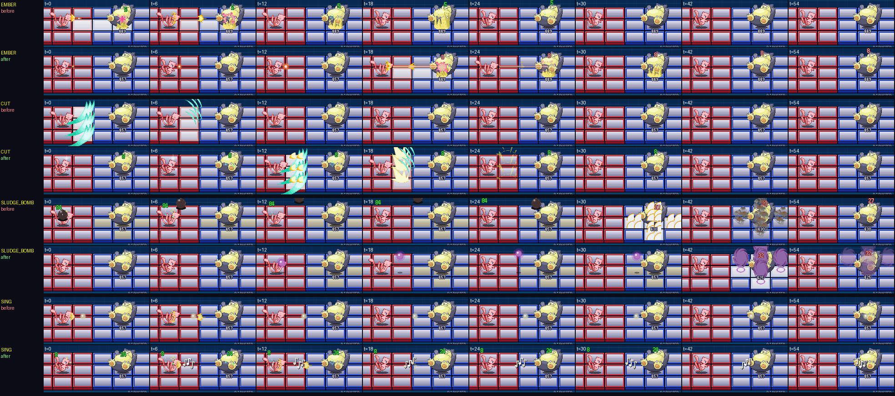
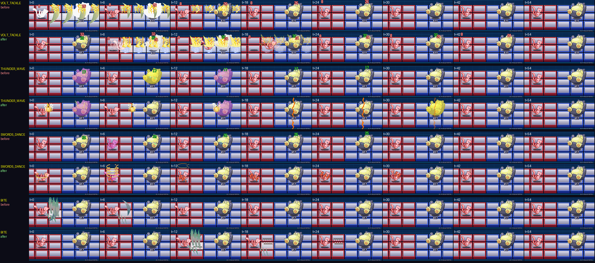
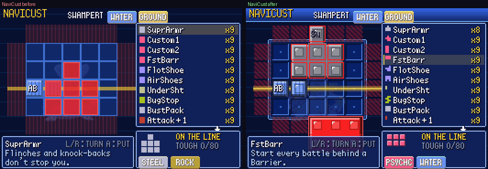

# POC-15 — Every chip's animation reviewed, BN pacing, NaviCust restyle

**Patches:** these go on top of 0001–0044.

- `poc/patches/0045-POC-15a-BN-paced-attacks-wind-ups-and-poses-from-BN6.patch`
- `poc/patches/0046-POC-15b-NaviCust-restyled-glossy-joined-program-bloc.patch`
- `poc/patches/0047-POC-15c-…` (gallery captions), `0048-POC-15d-…` (move sounds), `0049-POC-15e-…` (status, stat and
  turn sounds)
- Applying 0001–0049 onto the pin was checked in a clean worktree.

*Each pair is one move: before (top) and after (bottom), the same frames (t = frames since it was used).*

Values marked TUNE are our own; the timing numbers come from BN6's data, with cites.

## How every chip was checked: the chip gallery

- **`PKBN_GALLERY=all`:** a new self-test mode. It plays all 312 chip moves one after another on the same stage:
  - The user stands at (1,1) and the foe at (4,1), both at full HP on a clean field.
  - The foe doesn't act and nobody faints.
- **Options:**
  - `PKBN_GALLERY=52,85,...` plays only those moves.
  - `PKBN_GALLERY_SIDE=enemy` has the foe use them.
  - `PKBN_DUMP_EVERY=n` saves `g_MOVE_T.ppm` frames.
- **Tools:** `tools/chip_gallery_sheet.py` makes contact sheets, and `tools/chip_gallery_compare.py` makes before/after
  sheets like the ones above.
- **Coverage:** the review covered one move for every kind and type combination (161 sheets' rows), plus spot checks.
  Problems found and fixed are listed below.

## 15a — BN pacing

Attacks used to land on the frame the chip was used, and most effects were gone within 10–15 frames. BN6 paces them
with MegaMan's attack animations. The frame delays come from the sprite data (`data/sprites/battleSpriteMegaMan.spr`).
Which animation is which was identified by rendering its frames.

| action | BN6 animation (frame delays) | where its routine acts | our wind-up | pose held after |
|---|---|---|---|---|
| cannon | 8 (1,2,2,9,1,1,1,12) | `asm/asm31.s` sub_80EBC28 acts at counter 8 and 15 | 14 | 15 |
| sword | 5 (8,2,2,10) | sub_80EB862, sub_80EE1AC … at counter 12 | 12 | 10 |
| throw (bombs) | 6 | sub_80EB644 releases at counter 9 | 9 | 13 |
| point / cast | 12 (2,2,2,10) | — | 6 | 10 |
| breath and short blows | — | — | 8 (TUNE) | 10 |

- **When attacks leave:** the user winds up, then the attack leaves. The user can't act during the wind-up (BN locks
  the Navi during its animation).
  - **Priority moves:** half the wind-up.
  - **Enemy direct attacks:** they keep their 36-frame telegraph, and the enemy now winds up during it.
  - **A/B testing:** `PKBN_NO_WINDUP=1` brings back instant attacks.
- **Poses:**
  - During the wind-up the user draws back.
  - Then it lunges forward (6, 4, 2, 1 px) and eases home.
- **Flinch:** a real hit knocks the target back a few pixels for 20 frames. The white hit flash is now a strong tint
  on alternate frames, not a solid silhouette, so the impact effect stays visible.
- **Knock-back:** AirShot-style pushes slide the target over 8 frames instead of jumping.
- **Effects stay readable:** every BN effect sprite shows for at least 16 frames, holding its last picture, and fades
  over its last 5.
- **Damage numbers:** they rise more slowly, and the hits of a multi-hit fan out.
- **Visual events:** the rules now post what happened, and the drawing code plays it. A move used, an attack leaving,
  a push and a stat change are each an event. This is why moves that aren't attacks (stats, status, healing, weather,
  Protect) now have a pose and a cast. Before, they had no visuals at all.

## 15a — fixes found in the review

| kind | before | after |
|---|---|---|
| CANNON / AIRSHOT / VULCAN / SPREADER | the hit landed at once; the shot appeared afterwards | a glint at the muzzle during the wind-up, then a beam streak from the muzzle to the target at the moment it hits (enemy cannons too) |
| SWORD family | every move was a blade slash, punches included | each move strikes its own way (our table): blades slash; claws use BN's claw; bites snap two rows of fangs shut; punches and kicks get BN's hit flash and an impact ring; horns and pecks stab; whips get a tinted arc; tackles get a star and dust |
| DASH | the user stood still while slashes appeared down the row | the user charges down the row with two after-images and comes back |
| BOMB | a black bomb for every move, an arc off the top of the field, always an orange explosion | what's thrown matches the move (rock, fireball, BN bomb, or an orb of the type); a 30 px arc with a shadow on the floor; the blast takes the type |
| BALL | a small dim dot | a bigger, pulsing orb with a trail; sound moves fly as music notes, powders as a puffing cloud, gazes as rings |
| STATUS | nothing travelled; only a tint on the target | notes, powder, rings or an orb travel to the target; then BN's status picture; paralysis shows sparks and bolts; Mean Look and Spider Web show rings closing in |
| STATS | arrows were never shown (nothing drew them) | bigger arrows with a dark rim, red up and blue down, on whoever's stat changed |
| SELF (heals) | one quick sparkle | three rounds of BN's heal sparkles and green motes rising |
| FIREHIT / GOLEMHIT | a generic star for most types | type pictures: a big vortex and ring for Psychic and Ghost, a splash, leaves, poison, wind, a claw |
| TORNADO | small and short | 1.5× bigger, lasts the whole multi-hit |
| SHOCKWAVE | always a rock | rock, logs (Grass), splash (Water), flames (Fire), sparks (Electric), ice |
| LOCKON | the hit just appeared | a streak from the attacker at the hit |
| DELAYED | nothing visible during the 4-second wait | a vortex hangs over the foes' side, pulsing faster as it nears |
| Fly / Bounce | an orb flew; the user hung 48 px up | the Pokémon itself swoops down along the arc |
| AIRHOCKEY | a small flat disc | a bigger spinning disc with a trail |
| Protect | a very bright blob above the head | a half-tone barrier around the body |
| Smog and other poison CONEs | invisible (only the panel tint) | poison clouds (fixed with the effect lifetimes) |

## 15b — NaviCust restyle (our art, in the BN6 style)

- **Program blocks:**
  - Cells of the same piece join into one block.
  - The bevel and outline appear only on the piece's outer edges, and every cell has an inner plate and a glint.
  - Plus parts carry a "+".
  - Programs that aren't running are greyed.
- **Board:**
  - Each cell is a recessed socket with a circuit dot.
  - A metal plate sits under the board.
  - The overhang frame has red hazard stripes.
- **Command line:** a gold rail with a light pulse running along it.
- **Placing a program:**
  - The piece shows in its own colour with a white outline on the piece's edge (red where it can't go).
  - It's no longer drawn over the panels below the board.
- **List:**
  - Each program shows its own shape in its colour.
  - A gold bar and a pointer mark the current row.
- **The rest:** a blue gradient title bar and bevelled cells in the preview.

## 15d / 15e — sounds from Emerald's battle animations

- **15d, moves:** `tools/gen_move_sounds.py` walks each move's script in `data/battle_anim_scripts.s` and writes
  `src/pkbn/move_sounds.c` (when each sound starts, which SE, its pan). A move's sounds start when it's used; timelines
  longer than 60 frames are squeezed into 60 (TUNE). Pans are mirrored when the foe attacks.
- **15e, stat changes:** `SE_M_STAT_INCREASE` / `SE_M_STAT_DECREASE`, panned to the Pokémon, as `AnimTask_StatsChange`
  plays them (`src/battle_anim_utility_funcs.c:562-564`). They replace our old `SE_EXP_MAX` / `SE_BOO`, and play after
  the move's own sounds, as Emerald plays the stat animation after the move's. Speed Boost now shows its arrows too
  (`BattleScript_SpeedBoostActivates` plays `B_ANIM_STATS_CHANGE`).
- **15e, status and turn animations:** the generator also writes Emerald's status animations (`gBattleAnims_StatusConditions`)
  and general animations (`gBattleAnims_General`), and the rules post a `VEV_ANIM` event where Emerald plays one:

| when | animation | Emerald |
|---|---|---|
| a status is inflicted | its status animation (replaces `SE_BOO`) | `BattleScript_MoveEffectSleep/Poison/Burn/Freeze/Paralysis/Toxic`: `statusanimation BS_EFFECT_BATTLER` |
| poison / burn damage each turn | PSN / BRN | `BattleScript_PoisonTurnDmg`, `BurnTurnDmg` → `DoStatusTurnDmg` |
| nightmare / curse damage | NIGHTMARE / CURSED | `BattleScript_NightmareTurnDmg`, `CurseTurnDmg` |
| asleep / frozen / fully paralyzed when acting | SLP / FRZ / PRZ | `BattleScript_MoveUsedIsAsleep/IsFrozen/IsParalyzed` |
| hurt in confusion, immobilized by love | CONFUSION / INFATUATION | `battle_gfx_sfx_util.c:442-444` |
| weather goes on at the end of a turn | RAIN/SUN/SANDSTORM/HAIL_CONTINUES | `battle_util.c:2501` |
| Leech Seed drain | LEECH_SEED_DRAIN | `BattleScript_LeechSeedTurnDrain` |
| a trap's turn damage | TURN_TRAP | `BattleScript_WrapTurnDmg` |
| Ingrain, Leftovers (program), Wish | INGRAIN_HEAL, HELD_ITEM_EFFECT, WISH_HEAL | `BattleScript_IngrainTurnHeal`, `ItemHealHP_End2`, `WishComesTrue` |
| Focus Band (program) holds on | FOCUS_BAND | |
| Future Sight / Doom Desire lands | FUTURE_SIGHT_HIT / DOOM_DESIRE_HIT (replaces `SE_M_HYPER_BEAM`) | |

- **How they play:** several posted together play one after another (Emerald plays its end-of-turn animations in
  turn), 8 frames apart (TUNE). A new move doesn't cut them off. The same one on the same side plays at most once per 40
  frames (TUNE), so pressing A while asleep doesn't stack them.
- **Duplicates removed:** Rain Dance, Sandstorm and Hail also played a sound from the rules, on top of the move's own.
- `PKBN_NO_MOVE_SOUNDS=1` turns all of these off; `PKBN_LOG_SOUNDS=1` prints each one.

## Verification

- **Regression suites:** every outcome is the same as POC-14 except e2, which the autopilot now wins.
- **NaviCust tests:** all pass.
- **`scripts/owtests.sh`:** 27/27 pass, including the new `chip_gallery` check (all 312 chips play).
- **`tools/bot_compare.py`:** the smart bot wins 15 of 17 battles and the old autopilot 13. Fights are about 5
  seconds longer (20.9 s on average for the smart bot), as expected with the wind-ups.

## Open / TUNE

- **The wind-up numbers:** they are BN6's, but our Pokémon are bigger targets on a 6×3 grid. If swords feel sluggish,
  12 can drop to 8.
- **The strike table and type pictures:** our choice; worth a look in play.
- **Possible next steps:**
  - Pokémon-specific attack poses beyond Emerald's second frame.
  - Bigger BN effects for the Mega/Giga class.
  - NaviCust colour themes per Pokémon.
