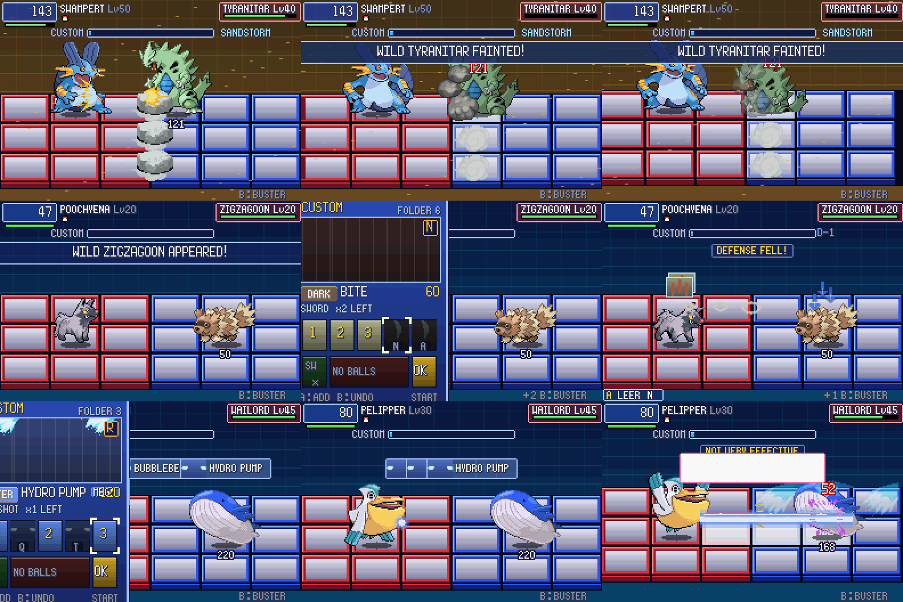
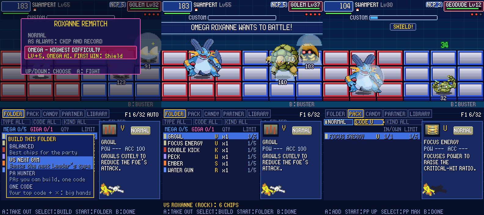
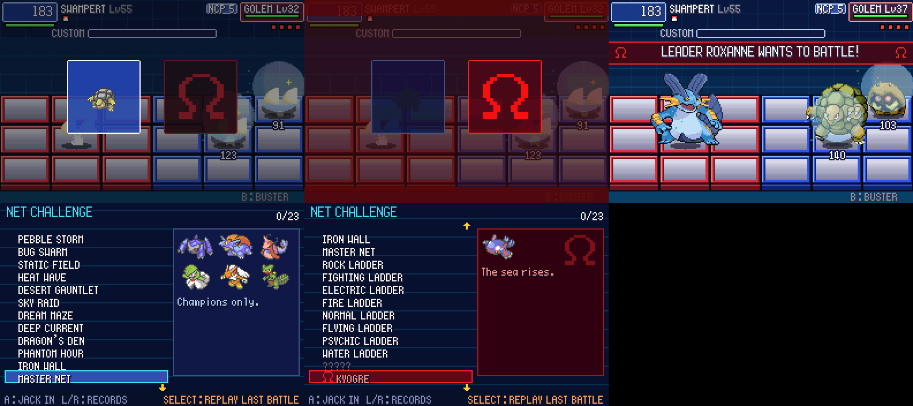

# POC-16: hits that feel heavy, Custom screen polish, folder builder, Ω rematches, harder custom battles

**Patches:** these go on top of 0001–0049.

- `poc/patches/0050-POC-16a-…` to `0055-POC-16f-…`.
- Applying 0001–0055 onto the pin was checked in a clean worktree.

These are your picks 2, 4, 5, 8 and 11. The design choices were approved on the "POC-16 Design Picks" page; all the
recommended defaults were kept.

*16f: the Ω choice (no words; on Ω the screen bleeds red and the ace growls), the Ω intro banner, and the NET
CHALLENGE list with a locked entry and an Ω battle.*

Values marked TUNE are our own numbers. Unless a line cites code, a rule is our own design.

## 16a: hits that feel heavy

- **Screen shake.** This is BN6's own camera shake:
  - `camera_initShakeEffect_80302a8(level, frames)` and `camera_doShakeEffect_80301e8` (`asm/asm03_0.s:20653-20751`).
  - Each frame the camera moves by `(rand & mask) - half` on both axes. The mask is 1/3/7/15 for levels 0–3
    (`byte_8030284`), so the camera moves up to ±1/2/4/8 px.
  - BN6's effect routines (the calls in `asm/asm31.s`) mostly use level 1–2 for 10–30 frames and level 3 for 30–45.
  - Here the battle field moves and the HUD stays put. The shake uses the drawing code's own random numbers and never
    touches the game's.

| what | level, frames (TUNE) |
|---|---|
| super-effective hit | 1, 10 |
| critical hit, counter hit | 1, 15 |
| a KO, a panel breaking | 2, 20 |
| MegaChip hit, boss phase | 2, 30 |
| Program Advance or GigaChip hit | 3, 30 |

- **Hit-stop.** This is our addition; BN6 doesn't freeze on hits.
  - The fight and its pictures freeze for a few frames: super-effective 3, critical 4, counter 6, PA or GigaChip 6,
    a KO 8 (TUNE).
  - Buttons pressed during the freeze still count; they're delivered on the next frame.
  - `PKBN_NO_HITSTOP=1` turns it off.
  - No battle outcome in the regression suites changed.

## 16b: around the Custom screen

All timings here are ours (TUNE).

- **The window** slides in from the left over 12 frames and back out over 10 after OK.
- **The chip stack.** During the fight, the chips you chose ride above your Pokémon (in BN they ride over MegaMan's
  head). The next chip is in front. A Program Advance shows its finisher's icon with a flashing rim.
- **PA forming.** At OK the three chips converge, flash white and become the PA's card, with its name and power. This
  replaces the old flash banner.
- **Sounds** (Emerald SEs; BN6's sound data isn't in the build):

| moment | sound |
|---|---|
| the window opens | `SE_WIN_OPEN` |
| taking a chip back | `SE_RG_BAG_CURSOR` |
| a PA forms | `SE_RG_POKE_JUMP_SUCCESS` (was `SE_EXP_MAX`) |

## 16c: folder builder

- **Filters.** FOLDER, PACK, LIBRARY and the Mart's CHIP SHELF have a filter bar with TYPE, CODE and KIND.
  - **UP** from the first row enters it.
  - **LEFT/RIGHT** change the value; you only get values the list has.
  - **A** moves to the next field; **DOWN** or **B** goes back to the list.
  - LEFT/RIGHT on the list still jump a page, which is why the bar sits above the list. The list now shows 10 rows.
  - One change: UP on the first row used to wrap to the bottom; it now enters the bar.
- **SELECT on FOLDER** opens a short menu of four build styles (just their names). The result goes into the folder you're editing, so F1, F2 and the
  extra folder work as presets.

| style | what it does |
|---|---|
| BALANCED | the auto-build as before (the folder code is refactored into `GreedyFill`; it builds the same folders) |
| VS NEXT GYM | weighs attack types by Gen 3's chart (`gTypeEffectiveness`) against the next Leader's type: ×2 → 2.5, ×0.5 → 0.375, ×0 left out |
| PA HUNTER | two of each recipe chip for every PA you can build, in a code the three share (else *), then BALANCED |
| ONE CODE | the code you own the most usable copies of, preferring that code and * for every chip |

## 16d: rare BN6 programs and Ω Leader rematches

### 19 new programs

- **Source.** All 19 are real BN6 programs. Their names, the quoted texts, exclusive groups, plus/normal parts, bug
  types and board shapes come from BN6:
  - the program table `StructArr_813944C` (`data/dat36.s:379`, read with `tools/bn6_ncp_shapes.py`);
  - the texts in `data/textscript/compressed/CompText873ECC8.s`.
- **Effects.** What each one does here is our port (TUNE).
- **Indexes.** They're appended, so saved program indexes don't move.
- **Which Pokémon counts.** Programs that act outside battle or on the shared folder read your **lead Pokémon's**
  board, as Emerald's field abilities read `gPlayerParty[0]`.

| program | BN6 text | here |
|---|---|---|
| Shield | "[B]+Left= Strong shield!" | hold B and press back: a 30-frame shield blocks everything; 150 frames to recharge |
| Reflect | "[B]+Left= Reflect attacks!" | as Shield; a blocked hit sends half its damage back |
| AntiDmg | "[B]+Left= Throw a star!" | hold B and press back: you use Swift (Emerald's star move) |
| MegFldr1 / MegFldr2 | "MegaChip +1 / +2" | 6 / 7 MegaChips in the folder |
| GigFldr1 | "GigaChip +1" | 2 GigaChips |
| FldrPak1 | "A 2-pack Custom1& MegFldr1" | +1 chip in the hand and +1 MegaChip |
| AttckMAX / SpeedMAX / ChargMAX | "MegaBstr AttckMAX…" | that Buster level becomes 5 |
| HP+300 / 400 / 500 | "Max HP" | +30 / 40 / 50% (the HP+ family's scale) |
| Battery / OilBody | "Attracts Elec / Fire Viruses!" | half the time a wild Pokémon of that type, exactly as Static and Magnet Pull do (`TryGetAbilityInfluencedWildMonIndex`, `wild_encounter.c`) |
| SneakRun | "No weak enemies" | a Repel that never runs out (`IsWildLevelAllowedByRepel`) |
| Collect | "Get more chips frm enmy" | battle chip rewards and repeat challenge clears pay one more copy |
| AutoHeal | "HP recv after battle" | after a win, this Pokémon gets back 25% of its max HP |
| Tango | "VS only! Heals low HP" | once a battle, below 1/4 HP, it heals 30% |

**Changes from the approved table.** Three of the programs on the page can't be placed on our board. BN6's BodyPack,
ChpShufl and FldrPak2 shapes are 5 cells tall, and our board is BN6's middle board, 5×4. So:

- Norman pays HP+500 (it was BodyPack).
- The Electric ladder pays Battery (it was ChpShufl).
- The Fire ladder pays OilBody (it was AutoHeal).
- Ω Groudon pays Tango (it was HP+500).
- Ω Kyogre pays AutoHeal (it was FldrPak1).
- Ω Rayquaza pays FldrPak1 (it was FldrPak2).

### Ω rematches (your rule)

- **When.** A Gym Leader rematch, once you hold that Leader's V3 chip, starts with a choice. The V3 chip is an S on a
  rematch.
  - The choice has no words: the Leader's lead Pokémon on a calm card, and a red Ω.
  - With the cursor on the Ω, the screen bleeds red and pulses, and the ace growls (its cry, played backwards).
  - An Ω battle's intro banner is red, with an Ω at each end.
- **What OMEGA changes:**
  - The Leader's Pokémon are 5 levels higher.
  - Their NaviCust is the tier-6 auto-layout.
  - They fight with the **Ω AI**, which only exists in these battles.
- **The Ω AI** (all TUNE):

| behaviour | what it does |
|---|---|
| aims ahead | if you stepped up or down in the last 12 frames, it lines up with the row you're heading to |
| counter-chips | picks its move that hits your active Pokémon hardest (type × STAB × power, the damage estimate); it keeps a trainer-AI status move 1 time in 3 |
| punishes end lag | fires 8 frames after you get stuck after an attack (at most once a second) |
| guards your big moves | when you wind up a PA or GigaChip and it knows Protect, Detect or Endure, it raises it |
| tempo | attacks 15% sooner and dodges 20% more often |
| earlier PAs | its PA comes at 2/3 HP and again at 1/3 |

- **Rewards:**
  - The first Ω win pays the Leader's rare program:

| Leader | program |
|---|---|
| Roxanne | Shield |
| Brawly | AttckMAX |
| Wattson | ChargMAX |
| Flannery | Reflect |
| Norman | HP+500 |
| Winona | SpeedMAX |
| Tate & Liza | MegFldr2 |
| Juan | GigFldr1 |

  - Later Ω wins pay a * chip of the ace's move, and keep an Ω record time.
  - The TIME ATTACK page has a red Ω column, showing your best Ω time once you've won one.
- **Save.** `pkbn.sav` is now v6: it keeps Ω wins and best times. Older files migrate.

## 16e: harder custom battles in NET CHALLENGE

- **Type ladders.** There are 8, for Rock, Fighting, Electric, Fire, Normal, Flying, Psychic and Water.
  - They open after the Champion.
  - Each is 5 foes, Lv55–62, one at a time; your HP carries over.
  - The foes are tier-5 rivals.
  - Their moves are each species' strongest level-up moves up to its level, from the game's own learnsets
    (`tools/pick_challenge_moves.py`).
  - The first clear pays the ladder's rare program:

| ladder | program |
|---|---|
| Rock | HP+300 |
| Fighting | AntiDmg |
| Electric | Battery |
| Fire | OilBody |
| Normal | Collect |
| Flying | SneakRun |
| Psychic | MegFldr1 |
| Water | HP+400 |

- **Ω legendaries.** Each opens once `FLAG_DEFEATED_GROUDON` / `_KYOGRE` / `_RAYQUAZA` is set. Emerald sets the flag
  whether you caught it or beat it (`data/maps/TerraCave_End/scripts.inc:42-52`, and the Marine Cave and Sky Pillar
  scripts). Each is a Lv80 boss with its POC-14 phases and signature PA.

| battle | rules | first clear |
|---|---|---|
| Ω GROUDON | cracked ground, sun, 120 s | Tango |
| Ω KYOGRE | rain, currents, nothing heals | AutoHeal |
| Ω RAYQUAZA | nothing heals, 150 s, a phase every 6 s | FldrPak1 |

- **The NET CHALLENGE list** scrolls; it has 23 entries. The Ω battles are listed as GROUDON, KYOGRE and RAYQUAZA with
  a red Ω.
- **"Nothing heals"** blocks healing moves, programs, abilities, Wish, Tango and the PA party heal.

## 16f: show, don't tell (your rule for everything on screen)

The game shows; it doesn't explain. Explanations stay in the code and these docs. This round's screens follow it, and so
do the older lines it touched.

- **Ω choice:** no text at all (above).
- **NET CHALLENGE panel:**
  - It keeps the foes' icons, a one-line flavour text, a clock if there's a time limit, and your best time.
  - Gone: foe counts and levels, weather and panel lists, "FOE STRENGTH", "NOTHING HEALS", the rewards ("FIRST CLEAR
    PAYS…"), "AGAIN: * CHIP DATA", and the unlock hints.
  - Locked entries show `?????`.
  - Flavour texts, for example: PEBBLE STORM "Something is rolling downhill.", DESERT GAUNTLET "The sand never stops.",
    the ladders "Stone upon stone.", "Live wires."…, GROUDON "The earth splits.", KYOGRE "The sea rises.", RAYQUAZA
    "The sky tears open."
- **Rewards** are only named when you get them: "TIME 0:08.2", then "GOT Shield!" ("GOT HardStn AND Zinc!" for the older
  challenges).
- **Battle:** these lines are gone; the shield, the flash and the sounds show them instead:
  - SHIELD! / REFLECT! / ANTIDMG: STAR!
  - SHIELD BLOCKED IT! / REFLECTED!
  - NOTHING HEALS HERE!
  - the Tango line
  - CAN'T AIM WITH MORE THAN ONE OUT!
  - CAN'T CATCH DATA IN A SIMULATION!
- **Custom screen:** these lines are gone:
  - SWITCH TO ANY POKEMON
  - NOBODY ELSE CAN FIGHT
  - ANY - NOTHING AFTER IT
  - FOLDER USED UP - NO LIMIT
  - the ball's rules (CAN'T CATCH A TRAINER'S / ONLY WITHOUT CHIPS / THROW INSTEAD OF CHIPS)
  - NO CHIPS LEFT - BUSTER is now NO CHIPS
- **Folder screens:**
  - The build menu has no descriptions, and there's no note after a build.
  - The Library's unseen chip shows `?????` with no how-to text.
  - "LOCKED: X LEARNS IT AT LV n" is just the failure sound (the row shows the level).
  - "PARTNER CHIPS: SWITCH IN + MOVE" is now PARTNER.
  - The copy limit reads "X: 5 MAX".
- **Rewards text:**
  - "ULTRA/MASTER BALL: … PICK ITS CODE" is now "A CHIP OF ITS MOVE!" / "CHIPS OF EVERY MOVE!".
  - "(COLLECT)" and "- THE RECORD TO BEAT" are gone.
- **The new programs' NaviCust texts** are BN6's own, lightly adapted: "B+Left: Strong shield!", "MegaChip +1", "No
  weak enemies", "Heals low HP"…
- **Still on screen, as game language:** Emerald's own battle messages (IT STARTED TO RAIN!, THE WISH CAME TRUE!…), and
  BN6's own texts (YOU CAN USE ONLY 5 MEGACHIPS, PROGRAM ADVANCE). Button hints at the bottom of menus stay too.

## Verification

- **Regression suites:** every outcome is the same as POC-15e. This includes the run with hit-stop and shake.
- **`scripts/owtests.sh`:** 31/31 pass. The 4 new tests:
  - folder_style
  - omega_rematch
  - shield_program
  - omega_kyogre
- **Self-test switches:** `PKBN_TEST_OMEGA=1` and `PKBN_TEST_LEFTB=frames`.

## Open / TUNE

- **Difficulty:**
  - In self-tests a Lv70–90 party with the smart bot beats the Ω legendaries in 10–15 s, so they may be easy.
  - The ladders are slow: a Lv70 Swampert and Pelipper got through 2 of the Rock ladder's 5 before the self-test's
    time limit.
  - The legendaries' level, the ladders' levels, and whether Ω legendaries should also use the Ω AI are the first
    knobs to turn after real play.
- **Hit-stop lengths and shake levels:** worth a feel in play.
