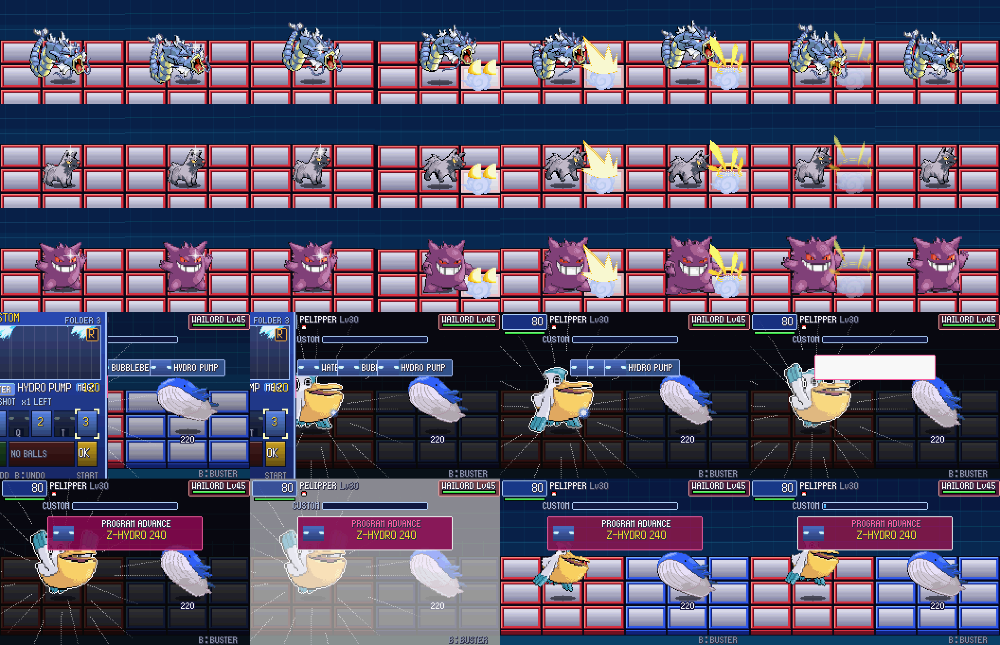
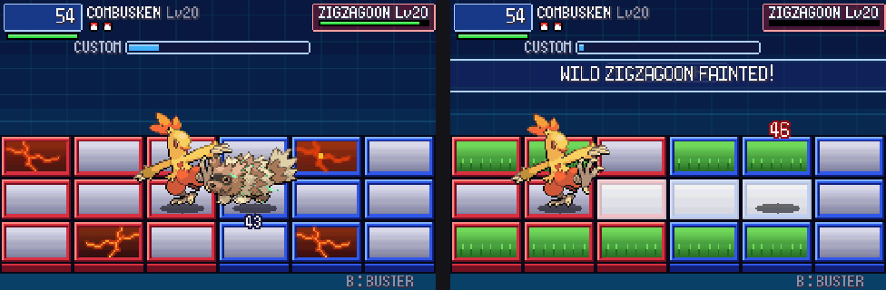

# POC-17: Pokémon that move like themselves, music, fields, and the Ω legendaries' AI

**Patches:** these go on top of 0001–0055.

- `poc/patches/0056-POC-17a-…` to `0059-POC-17d-…`.
- Applying 0001–0059 onto the pin was checked in a clean worktree.

These are your picks 1, 2, 4 and 8. For 8, only the Ω legendaries got the Ω AI, as you asked. The design choices
were approved on the "POC-17 Design Picks" page, with every recommended default kept.

*17b: species motion (Gyarados rotates, Poochyena glows dark, Gengar scales) and a PA cut-in.*

*17d: Fiery Path is a lava field. On Route 120, the middle row's grass has just burned away under Combusken's Ember.*

Values marked TUNE are our own numbers. Unless a line cites code, a rule is our own design. Nothing on screen
explains any of this (your show-don't-tell rule).

## 17a: the Ω legendaries fight with the Ω AI

- In a NET CHALLENGE with `CHR_BOSS` (GROUDON, KYOGRE, RAYQUAZA), `sB.omega` is set. This turns on the same AI as the
  Ω Leaders (POC-16d):
  - It aims ahead, counters chips, punishes end lag, and guards against PAs and GigaChips.
  - It attacks 15% sooner and dodges 20% more.
  - Its PA comes at 2/3 HP and again at 1/3.
- These battles also show the red Ω banner.

## 17b: species motion and big-move cut-ins

- **Each Pokémon's own animation.** Emerald gives every species a front animation
  (`sMonFrontAnimIdsTable`, `src/pokemon.c:1405`). It runs it through `sMonAnimFunctions`
  (`src/pokemon_animation.c:630`) when the Pokémon appears (`DoMonFrontSpriteAnimation`, `src/pokemon.c:6804`).
  - The grid owns one `struct Sprite` per fighter, its "puppet". It drives the puppet with Emerald's own animation
    function:
    - `Pkbn_FrontAnimId` (`src/pokemon.c:7182`);
    - `Pkbn_MonAnimStart` and `Pkbn_MonAnimDone` (`src/pokemon_animation.c:5532-5550`).
  - Each frame, the puppet's offset (`x2`, `y2`), its affine matrix (`gOamMatrices[31]`), its visibility, and its
    palette glow are copied onto our drawn sprite with `Gfx_DrawAffine`.
  - **When it comes out:** at normal speed, once the ball has opened.
  - **When it attacks:** at double speed through the wind-up and the strike. After that, a 6-frame ease back (TUNE).
  - **Glows** (red, black or yellow) come from the faded palette entry and show as a tint.
  - `PKBN_NO_MON_ANIMS=1` turns this off.
- **Big moves (TUNE).** The fight pauses for these, the same way it does for a hit-stop. The pictures keep moving,
  and buttons pressed meanwhile are kept.
  - **MegaChip:** a 12-frame dark flash, with a white rim on the user.
  - **PA or GigaChip:** a 28-frame cut-in:
    1. The screen goes black.
    2. Speed lines burst from the user (Emerald's `Cos`/`Sin`, `src/trig.c`).
    3. The user is drawn 1.25× larger and lit.
    4. A white flash.
  - `PKBN_NO_CINEMA=1` turns this off. The chip gallery skips it.

## 17c: music

Every track is Emerald's own (`sound/song_table.inc:479-491`). Story battles already played the right theme through
`GetBattleBGM` (`src/pokemon.c:6426`).

| battle | track |
|---|---|
| Ω Leader (starts the moment Ω is picked) | `MUS_VS_FRONTIER_BRAIN` |
| Ω GROUDON, Ω KYOGRE | `MUS_VS_KYOGRE_GROUDON` |
| Ω RAYQUAZA | `MUS_VS_RAYQUAZA` |
| MASTER NET | `MUS_VS_CHAMPION` |
| the type ladders | `MUS_VS_ELITE_FOUR` |
| the other NET CHALLENGEs | `MUS_VS_TRAINER` |

- The NET CHALLENGE track is chosen by `PkbnChallenge_BGM` (`src/pkbn/challenge.c`) and passed to
  `CreateBattleStartTask` in `BattleSetup_StartPkbnChallenge` (`src/battle_setup.c`).
- **Low-HP alarm.** This follows Emerald's `HandleLowHpMusicChange` (`src/battle_gfx_sfx_util.c:1090`):
  - When the active Pokémon's HP bar is red (`GetHPBarLevel == HP_BAR_RED`), `SE_LOW_HEALTH` plays.
  - Otherwise, and at the end of the battle (`BattleStopLowHpSound`, `:1120`), `m4aSongNumStop(SE_LOW_HEALTH)` stops it.
  - Emerald starts the alarm once. Here, moves make many more sounds, and those can take its music player
    (`MUSIC_PLAYER_SE3`, `sound/song_table.inc:99`). So the alarm starts again as soon as that player is free
    (our rule).
  - `PKBN_NO_LOW_HP=1` turns it off.
- Victory music is unchanged. The Ω Leaders get Emerald's gym-leader victory theme, and NET CHALLENGE wins get the
  trainer victory theme.

## 17d: fields

The field takes the shape of the place, with no message. Places are matched in this order:

1. Gyms and the Elite Four, by map (`include/constants/map_groups.h`).
2. Everywhere else, by Emerald's map section (`gMapHeader.regionMapSectionId`).
3. Anywhere else, the POC-13 terrain (2 grass or 1 cracked panel per side, from the battle environment).

Terrain panels never fade, and they never appear where the fighters start. The panel counts are per side (TUNE).

| place | field |
|---|---|
| Petalburg Woods, Routes 119 and 120, Safari Zone | 5 grass |
| Granite Cave, Meteor Falls, Jagged Pass, Desert Ruins, Seafloor Cavern | 2 cracked |
| Shoal Cave | 3 ice |
| Mt. Pyre | 2 holy |
| Fiery Path, Mt. Chimney, Magma Hideout, Lavaridge Town | 2 **lava** |
| Roxanne (Rustboro Gym) | 2 cracked |
| Flannery (Lavaridge Gym) | 2 lava |
| Winona (Fortree Gym), Wallace (Champion's room) | currents / wind (the POC-14 current layout) |
| Tate & Liza (Mossdeep Gym) | 1 holy |
| Juan (Sootopolis Gym) | 2 ice + 1 cracked |
| Sidney | 2 poison |
| Phoebe | 2 holy |
| Glacia | 3 ice |
| Drake | 2 cracked |

- **Lava panel (new; BN6 has none).** The panel is dark crust with molten cracks that pulse, and a bubble now and then.
  - Standing on it burns you, through `Field_TryStatus`. Gen 3's rules apply: Fire types and Water Veil are spared.
  - Fire types heal 1/16 per turn on it, as Grass types do on grass (TUNE).
  - Levitate and FlotShoe float over it.
- **Panels react (our rules, TUNE).** Each reaction flashes the panel. There's no text.
  - A Fire attack burns grass and melts ice back to normal on every panel it passes over.
  - A Water attack cools lava.
- **Weather works on panels** at the end of each turn (TUNE):
  - sun melts ice;
  - rain cools lava;
  - hail freezes a bare, empty panel half the time.
- NET CHALLENGE fields are unchanged: they keep their preset.

## Verification

- **Regressions:** all 33 self-test battles end exactly as they did in POC-15e.
- **owtests:** 33 of 33 pass, including 2 new ones:
  - `field_lava`: a Fiery Path battle gets the lava field.
  - `field_grass`: Route 120's grass burns away under Ember.
- 17b was checked frame by frame in the chip gallery.

## Open / TUNE

- Panel counts, the lava burn, lava healing and the hail chance are all our numbers.
- The foes' AI doesn't avoid lava yet; it doesn't avoid poison panels either.
- Shoal Cave ice covers the whole cave, not only its ice room.
