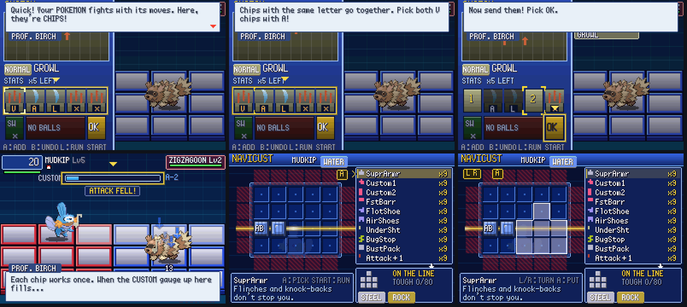

# POC-18: ready for friends — battle feel, tutorial, NaviCust unlock, polish

**Patches:** these go on top of 0001–0059.

- `poc/patches/0060-POC-18a-…` to `0069-POC-18j-…`.
- Applying 0001–0069 onto the pin was checked in a clean worktree.

These cover your notes on battle feel, the tutorial, NaviCust, and getting the game ready for friends. The choices
were approved on the "POC-18 Design Picks" page.

*Birch's rescue teaching the Custom screen and the fight, and the first-time NaviCust lesson.*

Values marked TUNE are our own numbers. Unless a line cites code, a rule is our own design.

## 18a: Custom screen controls

- **Cursor.** It now moves the way the slots are drawn (`MoveCustomCursor`, `src/pkbn/grid_battle.c`).
  - Left and Right move along a row, wrapping.
  - Up and Down jump to the nearest slot in the other row.
- **OK is a slot.** A on OK confirms.
- **Confirming.** Only START or A on OK confirm. R no longer does (your note).
- **Ball slot.** L and R change the ball there.
- **Bots.** The test bots use `PkbnGrid_CursorKeyToward` to move the cursor.

## 18b: NaviCust, taking a program off

- SELECT on a placed program takes it off the board.
- B while holding a program (picked up from the board, or new from the list) puts it back in the list.
- The hints read "A:MOVE SEL:OFF" and "A:PUT B:OFF".

## 18c: ready for friends

- **Files next to the game.** Saves, the log, the play log and the replay go next to the executable
  (`SDL_GetBasePath`).
  - If that folder can't be written, they go to the user's app-data folder (`SDL_GetPrefPath`).
  - `PKBN_DATA_DIR` overrides both.
  - A folder that can't be written at all no longer crashes the game at launch; it plays without saving.
- **Safe saves.**
  - `pkbn.sav` is written to `pkbn.sav.tmp` first, then swapped in, and the previous file is kept as `pkbn.sav.bak`.
  - A file that can't be read is kept as `pkbn.sav.bad`, and the backup is read instead.
  - With no readable file, the game starts in the "programs are earned" mode, not "everything unlocked".
  - A same-version file that's shorter than expected has its missing fields zeroed instead of being thrown away.
  - The Hall of Fame save now writes `pkbn.sav` too (`src/save.c`).
- **No console window on Windows.** The .exe is a GUI program (`-mwindows`), and the log goes to `pkbn_log.txt`.
  `PKBN_CONSOLE=1` brings the console back.
- **Gamepads.** These now go through SDL's GameController API, on any OS, instead of XInput 1.3.
  - That old XInput DLL isn't on stock Windows 10/11. The .exe now imports only `SDL2.dll`, `KERNEL32`, `msvcrt` and
    `SHELL32`.
  - The pad's A is A and its B is B (X is B as well), and Back is SELECT.
  - The pad and the keyboard work together.
- **Keys by position (scancodes).**
  - SELECT is Backspace, and `\` still works.
  - Ctrl+R is gone: it was a soft reset that closed the game without saving.
  - Space fast-forward stays (your note).
- **Window.**
  - F11 or Alt+Enter toggles fullscreen.
  - Resizing keeps the largest whole scale that fits.
  - The window is titled "Pokemon x Battle Network 0.18".
- **Running.** Running needs SELECT held for half a second (`RUN_HOLD_FRAMES` 30, TUNE). A ring closes around the
  player while you hold it.
- **Replays have no side effects.** A replay no longer uses up balls from your real bag or marks Pokémon as seen. It
  gives back the trainer ids, the battle environment and the RNG it borrowed.
- **Wild packs.** A pack roll no longer carries over into a later scripted battle after one of Emerald's own battles
  (Safari, Pyramid…).
- **Version.** "PKBN 0.18" appears in the title screen's border (`include/pkbn/version.h`).

## 18d: running from the Custom screen

- L on the Custom screen runs, as in BN6 ("And the L Button is for escaping.",
  `upstream/bn6f/data/textscript/TextScriptBattleTut1.s`).
- On the ball slot, L still changes the ball.
- Emerald's rules apply (`TryRun`): no running from trainers, Mean Look and similar effects, and abilities that
  block escape.

## 18e: battle feel (TUNE)

- **After OK.** Nothing fires for 30 frames (`CHIP_READY_FRAMES`), chips or buster (your pick).
  - The chips drop onto the Pokémon's head, darkened, and flash when they can be used.
  - The foes' attack timers wait just as long.
- **About 25% slower.**

  | timing | before | now |
  |---|---|---|
  | steps, at Speed 60 | 6 | 9 |
  | busy after a chip | 24 | 30 |
  | buster | 20 | 24 |
  | enemy steps | 40–90 | 50–112 |
  | enemy attack interval (18j) | — | ×1.25 |

  Wind-ups and enemy warnings are unchanged, so attacks stay readable.
- **Speed on the grid.** This uses the real Speed stat (your pick), through `Moves_EffectiveSpeed`, so stages,
  paralysis, Swift Swim and Chlorophyll all count.

  | | rule | examples |
  |---|---|---|
  | step pace | `5 + 480 / (Speed + 60)` frames | Speed 10: 12, 60: 9, 200: 7, 400: 6 |
  | wind-up and busy time | `× (0.8 + 24 / (Speed + 60))` | Speed 10: ×1.14, 60: ×1, 400: ×0.85 |

  - Foes follow the same rules.
  - Paralysis now slows steps through Gen 3's quartered Speed. This replaces the old flat ×4.

## 18f: the tutorial

`src/pkbn/tutorial.c`, `include/pkbn/tutorial.h`.

**Where it happens.**

- Birch's rescue on Route 101 is now the first grid battle (`CB2_StartFirstBattle` → our entry,
  `PkbnBattle_ShouldHandle` accepts `BATTLE_TYPE_FIRST_BATTLE`).
- Emerald's rules for that battle are kept:
  - The foe is Zigzagoon Lv2 with no item (`src/battle_controllers.c:67-72`).
  - No critical hits (`src/battle_script_commands.c:1281`).
  - No running: "PROF. BIRCH: Don't leave me like this!" (`src/battle_message.c:332`).
  - Emerald's first-battle AI flees once your Pokémon is at 20% HP or less (`AI_FirstBattle`,
    `data/battle_ai_scripts.s:3233`), so the rescue can't be lost.

**How it teaches.** This follows BN6's first battle (`TextScriptBattleTut1`, `BATTLE_MODE_TUTORIAL_1`).

- Prof. Birch talks you through each part, in this order:
  1. The Custom screen and the chips in hand.
  2. A chip's data, then the foe's HP.
  3. Picking the pair with the same letter. A wrong pick is refused with "Not that one! B takes a chip back.", like
     BN6's "Cancel with the B Button and reselect!".
  4. OK.
  5. Moving, the buster, A on the chips above the head, and the gauge with L/R.
- The battle waits on each line. The foe waits until you've used a chip.
- A "do it" line is skipped if you already did it.
- The lines are ours; BN6 gives the structure. Lessons are never shown in replays or self-tests (`PKBN_TEST_TUTORIAL=1`
  turns them on).

**The rescue's folder.** Your starter's two moves, 3 copies each, sharing one code. The second move takes its `*` when
it doesn't have the first move's code:

| starter | folder |
|---|---|
| Treecko | Pound L ×3, Leer L ×3 |
| Torchic | Scratch L ×3, Growl * ×3 |
| Mudkip | Tackle L ×3, Growl * ×3 |

**Later lessons.** Each runs once, in the first battle where it fits:

- the `*` code (the rescue's second Custom, if a `*` chip is in hand);
- the ball slot (your first wild battle with balls and one foe);
- SW (your first battle with two Pokémon able to fight);
- a Counter (the first time a foe is busy while you hold chips; BN6 `TextScriptBattleTutFullSynchro`).

**Save.** `pkbn.sav` v7 adds `tutorialSeen`. Games saved before v7 count every lesson as seen, so you won't get them
on your current save, and NAVICUST stays open there as it was.

## 18g: NaviCust opens after Roxanne

- **When.** NAVICUST appears in the party menu with the Stone Badge (`FLAG_BADGE01_GET`, `PkbnNaviCust_Unlocked`).
- **Rewards.** A new game no longer starts with programs (your pick). Roxanne's first defeat already pays Iron and
  UnderSht (`src/pkbn/leader.c` `sFirstWinPrograms`). Programs won before then are kept.
- **The lesson.** The first time you open NAVICUST, one line appears: "Programs power up your POKEMON. Set one on the
  board!". Then a pulsing button shows each step:
  1. A to pick a program (the cursor starts on one you have).
  2. L R and A to turn it and place it.
  3. START to run the board.

## 18h: keys card

- F1 shows which key is which and pauses the game.
- The START menu already has its 9 rows (`sCurrentStartMenuActions[9]`), so the card lives on F1. The How to Play
  page says so.

## For friends

- `docs/HOW_TO_PLAY.html`: getting started (Windows; Mac through CrossOver, Whisky or Porting Kit; Linux), the keys,
  how a grid battle works, the menus, and what to send back.
- `scripts/package_playtest.sh`: builds the Windows .exe and zips it with `SDL2.dll` and the How to Play page into
  `poc/bin/pkbn-playtest-<version>.zip`. The zip is never committed.
  - Your pick was to allow sharing the build privately, which means rule 6 in CLAUDE.md needs your edit first; I
    haven't changed it.
- `scripts/setup_host.sh` now downloads SDL 2.0.22 from SDL's GitHub releases (archive.org wasn't reachable) and
  takes `SDL2.dll` from the same download.
- **Windows checked under Wine.**
  - A full battle and Birch's lesson ran.
  - The log went to `pkbn_log.txt`, and the saves and replay were written next to the .exe.
- **Mac.** There's no native build; see the Open section.

## Verification

- **Regressions:** 32 of the 33 self-test battles end as they did in POC-15e. The one change, x7, was a loss and is
  now a win, which is expected from the new pace.
- **Self-test time limit:** raised from 2 to 3 minutes, since battles are slower (18i).
- **owtests:** 35 of 35 pass.
  - New: `rescue_lesson` (the bot follows Birch's lesson to the end) and `catch_lesson`.
  - `net_challenge` waits longer for the slower battle.

## Open / TUNE

- The pace numbers, the Speed curves and the 30-frame gap after OK are all ours.
- The foes don't avoid lava or poison.
- **Mac.** The port only builds for Linux and Windows. A native Mac build needs build changes (ELF section directives
  and objcopy in the data assembly) and a Mac or a macOS CI runner to test it.
- The NAVICUST row is hidden before Roxanne. Nothing on screen says it's coming (show, don't tell).
