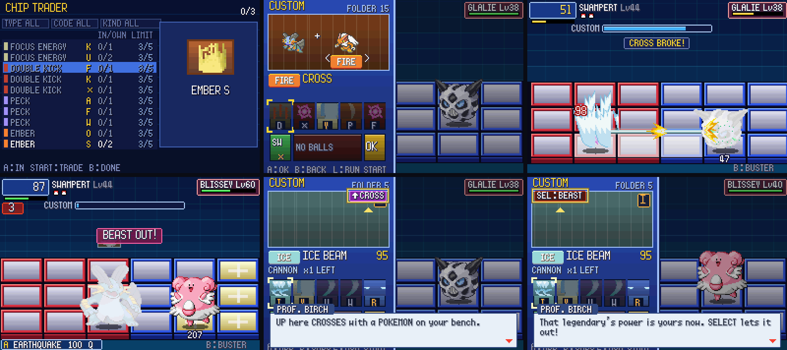

# POC-19: playtest notes, BN6's Regular Chip, Chip Trader, Cross and Beast Out

**Patches:** these go on top of 0001–0070.

- `poc/patches/0071-POC-19a-…` to `0080-POC-19g-…` (in commit order: 19a, 19b, 19c, 19d, 19e, 19f, 19h, 19i, 19j, 19g).
- Applying 0001–0080 onto the pin was checked in a clean worktree.

These cover your playtest notes, and the picks you approved on the "POC-19 Design Picks" page.

*Chip Trader's result; the Cross window and a Cross breaking; Beast Out; the Cross and Beast Out lessons.*

Values marked TUNE are our own numbers. Unless a line cites code, a rule is our own design.

## 19a: your notes 1, 2, 6 and 7

- **Catches pay EXP** (note 1). `AwardExpForFaintedEnemy()` runs before the catch ends the battle; NET CHALLENGE
  battles still pay nothing.
- **SW when nothing works** (note 2). When no chip in the hand can be used by the Pokémon in battle, the cursor starts
  on SW, so Struggle is no longer forced.
- **Held D-pad repeats** (note 6) in FOLDER, NAVICUST and NET CHALLENGE, using Emerald's key repeat
  (`gMain.newAndRepeatedKeys`).
- **Teleport in a pack** (note 7). A wild Abra's Teleport with others still standing removes only that Pokémon:
  "WILD ABRA FLED!", no EXP for it, and the fight goes on (`TryTeleportEscape`, `src/pkbn/grid_battle.c`).

## 19b: a playable chip in every hand (note 4)

- `GuaranteePlayable()`: if nothing in the hand can be used by the Pokémon in battle and the draw pile has a chip it
  can use, that chip swaps in for a random hand chip.
- **Test tools.**
  - `PKBN_BOT=buster`: a bot that only stays in the back row and fires the buster (your note 5).
  - `PKBN_TEST_SEED`: sets the random seed for a run.

## 19c: learning a move gives 3 copies

Your note on the picks page. `GrantLearned` (`src/pkbn/pkbn_save.c`) adds 3 copies, spread over the move's codes.

## 19d: BN6's Regular Chip

- In FOLDER, SELECT > **REGULAR** marks the highlighted chip. It's in your first hand every battle (`DealRegular`).
- A red "REG" tag marks it in the list.
- **Size limit.** 20 MB + 5 per badge (TUNE). A chip over the limit is refused with "REG: n MB MAX".
- **Save.** `pkbn.sav` v8 adds `regMove` and `regLetter` per folder.

## 19e: the FOLDER lesson (learn by doing)

- **First visit.** One line, "Your chips go in your FOLDER. Build it yourself!". Then pulsing prompts walk you through
  it: take a chip out, go to PACK, put one in, go back, done.
- **Second visit.** SELECT and START pulse.

## 19f: BN6's results window

- After a battle, BN6's results window slides in over the battle, which stays behind it at half brightness. It replaces
  the black screen.
- **What it shows.** The time, the Busting Level, and the reward revealed tile by tile, then the reward's name.
  - The window, digits, Zenny and HP pictures come from BN6 (`asm03_0.s:11516-13320`, `data/dat38_86.s`).
  - A chip reward shows its icon.
- **Building it.** `tools/gen_bn6_results.py` extracts BN6's data at build time into
  `include/pkbn/bn6_results_data.h`. That header is gitignored and never committed (rule 6).
  - `scripts/setup_host.sh` runs the tool.
  - Without the header the game builds and skips the window.

## 19h: BN6's Chip Trader

- **Where.** A **CHIP TRADER** row on the PC.
- **Trading.** Put in 3 chips (any chips: BN6 ignores what goes in) and get 1 back.
  - The screen is the FOLDER's PACK page in trader mode. A marks a copy, START trades.
  - The result is revealed row by row.
- **The Special trader.** From the fifth badge (TUNE), SELECT switches to it: 10 chips in, rarer chips out.
- **The roll** (`src/pkbn/chip_trader.c`), following BN6's `sub_804BD00` (`asm/asm03_2.s:8970-9445`):
  1. Pick a group: 75% chips you've had before, 25% new ones.
  2. Pick a rarity with weights `{0x70,0x60,0x18,0x10,0x08}`.
  3. A rarity 3+ chip may be redrawn over the whole list. The chance grows with the copies you own: 0, 25, 50, 62.5,
     then 75%.
  4. Pick the code: 75% a code you don't own yet.
- **Ours (TUNE).**
  - BN6's chip lists are per machine. Ours is every standard chip up to an MB cap of 24 + 6 per badge (+15 for the
    Special trader).
  - Rarity comes from MB.
  - The Special trader's weights aren't decoded in BN6, so ours lean rarer.

## 19i: Cross

- **How.** On the Custom screen, Up from the top row opens the Cross window, as in BN6. Left and Right pick a
  Pokémon on your bench, and A crosses.
  - The window shows your Pokémon + the partner, and the type you'll get.
  - A "^CROSS" tab on the art box shows when you can.
- **Effects while crossed** (TUNE):
  - Moves of the partner's type do x1.5 damage. BN6 gives +50 attack to matching-element chips.
  - The buster goes up one level.
  - Your Pokémon can use the partner's chips. They share the folder, so this is the partner's stamina.
  - A super-effective hit on the crossed type does x2 and breaks the Cross (BN6: double damage and unlinked;
    `TextScriptShukoCrossTut.s`).
- **How it shows.** The type badge sits next to the name, and the Pokémon glows in that type's color.
- **Limits.**
  - Once per battle.
  - It ends when the Pokémon leaves the field.
  - It unlocks with the third badge (Wattson; TUNE).
- **Lesson.** Two Birch lines the first time it's available.

## 19j: Beast Out

- **Unlock.** Beating or catching a legendary boss opens it. This is stored as `beastBosses` in the save's spare byte,
  so there's no new save version.
- **How.** SELECT on the Custom screen arms it ("SEL:BEAST" tab, which turns red and shakes when armed). OK lets it out.
- **Effects for 3 Customs** (BN6 `SetBeastOutCounterTo3`, `asm00_2.s:11743`):
  - Chips do x1.3 (BN6 gives +30 to elementless chips; we have none, so all chips get it).
  - A chip that can't reach the foe jumps you to a panel where it can (BN6 chips home in).
  - The buster fires at twice the rate.
- **Afterwards** your Pokémon is tired. Going out again while tired ends in **BEAST OVER**: 1/4 of max HP lost and a
  1-second stun (TUNE; BN6's Beast Over is harsher).
- **How it shows.** A red flicker on your Pokémon, and BN6's 3-2-1 counter under the HP box.
- **Lesson.** Two Birch lines the first time.

## 19g: late-game balance (your note 5 and the picks)

You asked for a better test bot first, then foe HP, AI rate and our multipliers.

**Buster only** (note 5, `PKBN_BOT=buster`, 3 seeds each): it wins through Roxanne, loses to Wattson and runs out of
time against Norman. Your pick was to leave it.

**The smart bot was the weak link.** These logs drove the fixes:

| Seen in the logs | Fix (test bot) |
|---|---|
| Norman: Swampert used its last chip on turn 8, then busted for 12 turns without switching | Switch to the benched Pokémon with the most chips left |
| Drake: 11 idle turns with Ground chips against Altaria | Switch after two Customs with nothing worth picking |
| Juan: sent Blaziken into Whiscash's Earthquake with Pelipper on the bench | After a faint, send the Pokémon the foe's moves hurt least |
| A plus-shaped blast on its panel can't be left in one step | Two-step dodge |
| Running low on chips | Cross with the partner that has the most chips |

**Game changes** (TUNE):

- Foes stop using stat moves once a stat is at +2 (it used to be a 50% stop). Juan's Whiscash reached +6 Sp. Def
  before the player's second Custom, because a real-time foe acts about 3 times per Custom.
- Thrown bombs fly 40 frames instead of 30, so a blast centred on you can be left in two steps.

**Results.** Smart bot, `PKBN_TEST_PACK_LEARNED=1`, the same 3-Pokémon test parties, 3 seeds each.

| Fight | POC-19 start | Now |
|---|---|---|
| Wattson | 2 of 3 | 3 of 3 |
| Norman | 3 of 3 (124–171 s) | 3 of 3 (83–105 s) |
| Juan | 0 of 3 | 0 of 3 (one is a 3-minute timeout) |
| Drake | 0 of 3 | 0 of 3, with about twice the damage dealt |
| Wallace | wiped in 23–27 s | 0 of 3 (two are 3-minute timeouts) |

**Not changed yet, your call:**

- These test parties have 3 Pokémon against 5–6. A real player will have more, and will dodge better than the bot.
- What's left is the foe's tempo: about 1 attack every 2.5 s at Speed 100. Tiers speed that up by 5% each (Juan
  20%, E4 25%).
- Fast travel moves: Earthquake's wave moves a panel every 10 frames.
- The knobs, if you want the late game easier:
  - (a) lower the per-tier speed-up;
  - (b) foe damage x0.85 from tier 4;
  - (c) slower waves.
- I haven't picked one. I'd rather your friends' playtests decide.

**Debug.** `PKBN_DEBUG_DMG=1` prints every hit's inputs (power, stats, stages, abilities, weather). It's how the
Amnesia stacking was found.

## Verification

- **Regressions:** 31 of 33 self-test battles end as in POC-18. The other two (e4 and t5) were a loss and a timeout
  and are now wins, because the random stream shifted (e4 diverges at a critical-hit roll).
- **owtests:** 37 of 37 pass.
  - New: `chip_trader` (3 GROWL copies in, EMBER S out).
  - `field_grass` now waits longer, because the first hand opens with Growl before Ember.
- **Self-tests:** `PKBN_TEST_CROSS`, `PKBN_TEST_BEAST`, `PKBN_TEST_TRADER_SP`, and `PKBN_TEST_SEEN=<hex>` (lessons
  already seen).

## Open / TUNE

- Every number in Cross, Beast Out and the Chip Trader is ours, apart from the cited BN6 roll and counter.
- Beast Out doesn't end when you switch: it's the trainer's power, not the Pokémon's.
- Late-game balance: see 19g. It's waiting on your pick or on playtest data.
- You asked for more thinking on the "special sauce" after this round. It's on a separate page.
