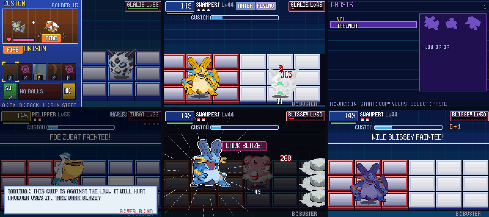

# POC-20: Bonds and Unison, Ghost NetBattles, Dark Chips

**Patches:** these go on top of 0001–0080.

- `poc/patches/0081-POC-20a-…` to `0085-…`.
- Applying 0001–0085 onto the pin was checked in a clean worktree.

These are the three ideas you picked on the "POC-20 Design Picks" page, built to the choices on the "POC-20 Plan" page.
Balance waits for your friends' playtests, as you picked.

*The Unison window with the Bond heart; the pair's Program Advance; NET CHALLENGE > GHOSTS; Tabitha's offer; DARK
BLAZE; the dark aura afterwards.*

Values marked TUNE are our own numbers. Unless a line cites code, a rule is our own design.

## 20a: Bonds and Unison

**Bonds.** Each pair of party Pokémon has a Bond from 0 to 100 (TUNE). It grows when they fight together:

| Event | Bond |
|---|---|
| Crossing with that partner | +6 |
| Switching in for the other right after it took a hit (within 2 s) | +2 |
| A Program Advance that uses both their chips (while crossed) | +4 |
| Both took part in a won battle | +1 |

- A Bond belongs to the two Pokémon (their personality values), so it follows them through the PC.
- 32 pairs are kept; when that's full, the weakest Bond makes room.
- It's stored in `pkbn.sav` v9.
- **Where you see it.** Only in the Cross window, as your pick: a heart and a meter. When the meter is full, it pulses
  and the window says UNISON.

**Unison.** Crossing with a partner at a full Bond is a Unison:

- **The look.** Your Pokémon takes on the partner's colors, and the HUD shows both types.
- **The pair's Program Advance.** The two Pokémon's best moves (same type first), then any `*` chip. Their codes don't
  have to match.
  - It hits every enemy panel at 200 power (TUNE).
  - It uses whichever of the pair's types hits the foe harder, chosen as it fires.
  - It's named after the pair, for example SWAMPERT+PELIPPER.
- Like Cross, it's once per battle, and a super-effective hit still breaks it.

**Your note on fusion.** I looked at how fusion fan games build their sprites:

- **Pokémon Fusion (Alex Onsager).** It pastes one Pokémon's head on the other's body and swaps the body's colors to
  match the head. Each of the 151 heads was cut out by hand.
  ([Inverse](https://www.inverse.com/article/57026-pokemon-fusion-website-twitter))
- **Tuxemon.** Its open-source fusion code does the same with per-monster face data and replaces three tiers of
  body colors with the face's.
  ([source](https://tuxemon.readthedocs.io/en/latest/_modules/tuxemon/fusion.html))
- **Pokémon Infinite Fusion.** Most of its sprites are drawn by community artists. The FAQ calls the rest
  "placeholder sprites" and doesn't say how they're made.
  ([Infinite Dex FAQ](https://infinitefusiondex.com/faq))

What we did:

- I prototyped both steps on Emerald's own sprites (`research/fusion_study.py`, `research/fusion_study.png`).
- **The color step works for every pair.** `Gfx_FusePalette` groups the body's colors by hue and gives them the
  partner's hues and saturation. The body keeps its own lightness, so the shading survives.
- **The head step doesn't work automatically.** Without hand-cut heads the results look broken, so the head swap
  isn't in.
- **What a head swap would need.** A head box and attach point for each species: 386 entries, made by hand or with a
  drawing tool.

## 20b: Ghost NetBattles

**In the game.** On the PC, open NET CHALLENGE and press R twice for **GHOSTS**:

- **START** copies your ghost code to the clipboard.
- **SELECT** pastes a friend's code.
- **A** fights the highlighted ghost.
- The list shows your best time against each ghost. The panel shows the ghost's team as silhouettes, with their
  levels.

**What a ghost carries.** For each Pokémon:

- species, level, moves, nature, ability, IVs and EVs;
- its NaviCust, up to 8 programs, recompiled by your friend's game;
- a fighting style read from your play log.

**How the style is read.** Each battle's log line now records, for each Pokémon, how long it stood in each column and
whether its chips were melee, ranged or area. At export, that history becomes one of the wild styles from POC-13. All
thresholds are TUNE:

| Style | When |
|---|---|
| TURRET | Area chips are at least a third of its chips |
| BRUISER | Front column at least 40% of the time, more melee than ranged |
| HARASSER | Front column at least 40% of the time otherwise |
| SNIPER | Back column at least half the time |
| BALANCED | Everything else, and under 10 s of fights on record |

**The battle.**

- The ghost fights at rival tier 5, like the Elite Four (TUNE), with its own NaviCust.
- Each Pokémon plays its style: where it stands and which moves it prefers.
- The battle is a NET CHALLENGE: nothing is lost.

**Rewards.** Records only, as you picked: the best time and Busting Level per ghost, kept in `pkbn.sav` v9.

**The code.** "PKBN-" followed by Crockford base32 and a 16-bit check. A team of 3 is about 140 characters; 6 Pokémon
with full NaviCusts is under 500. Friends' codes are kept in `pkbn_ghosts.txt` next to the game, up to 16.

**Ghost League page.** It's on claude.ai: each friend posts their code, copies the others' codes, and posts their best
time and Busting Level against each ghost. Each ghost gets its own ranking.

- Friends need to be invited **as Editors** from the page's Share menu to post. Anyone outside your organization who
  only has a link can read it but can't write.
- Each person can only change their own row.

## 20c: Dark Chips

**Who offers them.** After you beat them, each of these offers one Dark Chip, once. YES or NO is final.

| Giver | Chip | Effect |
|---|---|---|
| Tabitha | DARK BLAZE | Fire, 300, every enemy panel |
| Matt | DARK TIDE | Water, 300, a wave over all three rows |
| Shelly | DARK FREEZE | Ice, 300, a wave over all three rows |
| Maxie | PRIMAL QUAKE | Ground, 375, a shockwave over all three rows (Groudon's power) |
| Archie | PRIMAL SURGE | Water, 375, every enemy panel (Kyogre's power) |

- Powers are about 2.5x the strongest move of the type (your pick; TUNE).
- Your plan page said six; Emerald has five. There's no Courtney in Emerald's trainer data
  (`include/constants/opponents.h`).

**From BN6.** DarkChips are "against the law", and "You can use only 1 of the same DarkChip"
(`bn6f data/textscript/compressed/CompText87E9578.s`, `CompText86CEE84.s`). Each Dark Chip you take is in your folder
once, with code `*`. Everything else here is ours.

**The price.** Each use costs (all TUNE):

- the user's friendship, −20 (that lowers its partner-chip level and Return);
- its Bond with every other party Pokémon, −10;
- for the rest of that battle: no Full Synchro, no Cross, no Unison;
- a dark aura on the grid while its friendship is under 100.

**How it looks.**

- The offer is a line from the giver after the Busting Level: "THIS CHIP IS AGAINST THE LAW. IT WILL HURT WHOEVER
  USES IT."
- Dark Chips have violet-black frames in Custom.
- Their name and power show in violet.

**Not in yet.** The party-screen mark. Emerald's party menu needs its own work for that, so I left it for later.

## Verification

- **Regressions:** all 33 self-test battles end exactly as in POC-19.
- **owtests:** 40 of 40 pass.
- **New owtests:**
  - `ghost_netbattle`: paste, copy and jack in from the PC.
  - `unison_pa`: the pair's Program Advance forms.
  - `dark_offer`: Tabitha's offer is taken.
  - `dark_use`: DARK BLAZE and its costs.
- **New test switches:**
  - `PKBN_TEST_BOND=<n>`: every pair's Bond.
  - `PKBN_TEST_UNISON_PA`: the first hand is the pair's Program Advance.
  - `PKBN_TEST_GHOST=<code>`: fight that ghost.
  - `PKBN_TEST_GHOST_EXPORT`: print your ghost code.
  - `PKBN_TEST_CLIPBOARD`: stands in for the clipboard.
  - `PKBN_TEST_DARK=yes|no`: the answer to an offer.
  - `PKBN_TEST_DARK_CHIPS=<mask>`: which Dark Chips you own.
  - `PKBN_BOT_DARK`: the bot uses Dark Chips.

## Open / TUNE

- Every number above is ours: Bond points, Unison power, the habit thresholds, ghost tier 5, Dark Chip power and its
  costs.
- The head swap for Unison needs hand-made head data (20a).
- The Dark Chip party mark (20c).
- Ghosts use the trainer name from the save. Two friends with the same name are told apart by their codes, not by
  their names.
